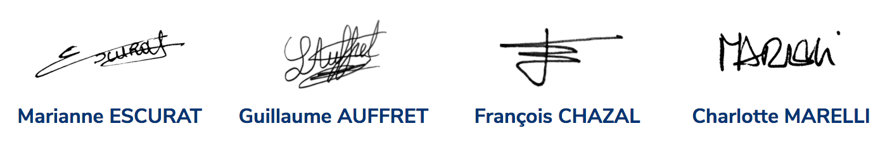

# Notre Tribune Fondatrice

## 60 ans de construction européenne

*Soixante ans d’une Union toujours en paix ! D’une réconciliation initiée dans un traité signé à Rome entre des frères autrefois ennemis, aujourd’hui partenaires...*

Première ambassadrice des valeurs humanistes héritées des Lumières, l’Union européenne a diffusé ces idéaux par delà ses frontières. Six à l’origine, nous sommes aujourd’hui vingt-sept à partager cette ambition au sein d’une même Union.

Bien plus que des valeurs, c’est une Europe du quotidien que nous partageons. Ce sont des frais d’itinérance supprimés dès juin 2017, une traçabilité alimentaire qui nous protège, les mêmes pièces dans notre porte-monnaie à Berlin comme à Athènes. Ce sont aussi tous nos déplacements qui sont facilités et encouragés quand on voyage aussi facilement entre Paris et Nice qu’entre Toulouse et Barcelone, rien qu’en France, près de 350000 de travailleurs frontaliers bénéficient chaque jour de la liberté de circulation.

Sommes-nous devenus les enfants gâtés d’un monde où près d’une personne sur dix ne mange toujours pas à sa faim (source) ?

Oui, l’Union européenne est imparfaite. À force de démissions successives de nos dirigeants, elle s’est faite autour du commerce et a délaissé l’aspiration sociale et sécuritaire de nos sociétés.

**Reconnaissons-le pour l’améliorer, pour NOUS améliorer !**

## L’heure n’est plus à la démission

Notre relation à l’Europe est faite de lâchetés successives et de renoncements du quotidien. Nos gouvernements ont trop souvent manqué de franchise et n’ont pas eu l’honnêteté d’assumer leur propre position devant leurs peuples. Avant d’accuser la technocratie bruxelloise, portons un regard lucide sur les positions qui sont défendues à Bruxelles par nos représentants.

L’avenir sera fait de nombreuses épreuves auxquelles il nous faut nous préparer. Le changement climatique et les bouleversements géopolitiques mettent déjà sous tension nos défenses communes alors même qu’elles sont encore à renforcer, ou à inventer. Dans ce contexte, il n’y a pas de reniement possible.

Dans ce contexte, seules la discussion, l’audace et l’exemplarité fonderont un projet correspondant aux attentes des peuples européens pour répondre aux défis de notre siècle. Nous sommes convaincus que seul un projet commun maintiendra notre rang dans le concert des nations, avec une Europe aujourd’hui considérée comme une terre d’asile, respectueuse du droit et prospère.

Piégées entre des pays continents, États-Unis, Chine, Inde, Brésil, nos nations n’auront bientôt plus le poids suffisant pour défendre seules leur droit à décider d’elles-même.

**L’Union européenne est désormais l’échelle où se défend notre souveraineté.**

## La France, au cœur d’un renouveau européen

Les 23 avril et 7 mai prochains, les Français se prononceront dans les urnes pour élire celui qui portera l’avenir de la France en Europe et dans le monde. Puis viendra l’Allemagne, puis l’Italie. L’élection présidentielle française peut être le premier domino d’une nouvelle dynamique en Europe. Avec ces votes, se redessinera le visage de l’Union pour les prochaines années.

2017 peut être l’année où les Français redonneront à l’Europe sa vocation originelle : protéger nos valeurs et préserver nos intérêts. Il est temps que l’Europe ne soit plus présentée comme une contrainte : elle nous appartient. Parce que l’Europe c’est NOUS. Et qu’il ne tient qu’à NOUS de la changer.

À l’image de nos aînés qui ont créé la Communauté européenne du charbon et de l’acier en 1950, il nous faut nous aussi agir, ensemble, pour relever les défis de notre temps : changement climatique, révolution numérique, souveraineté économique, protection commerciale, sécurité et migrations.

Ce qui se joue lors de cette élection, c’est la capacité de la France à engager l’Union européenne dans l’avenir, avec ses partenaires. Le choix des Français devra se porter sur un président qui assumera les vérités nécessaires à la refondation du projet européen et enfin faire entendre une autre voix que celle de l’accablement systématique de « Bruxelles ».

**Plutôt que la complainte du rejet et les sirènes du repli, une voix forte pour la France et l’Europe.**

## Avec Emmanuel Macron, une nouvelle dynamique pour l'Union

Au cœur des débats qui agitent l’opinion française, seul Emmanuel Macron fait applaudir l'Europe pour ce qu’elle est : imparfaite mais perfectible.

Aujourd’hui, nous espérons que 2017, plus qu’un sursaut, sera l'année d'un renouveau européen. En conscience, Emmanuel Macron rappelle que « notre défi, ce ne sont pas nos petites guérillas, c'est de savoir comment l'Europe existe, défend sa vision, ses intérêts et se protège dans ce monde d'incertitudes » !

Son audace sert l'ambition de restaurer le projet politique européen en remettant le citoyen en son cœur, quand le sentiment général est à l'épuisement des idées et des méthodes.

**NOUS SOMMES PRÊTS** à accompagner les Conventions démocratiques qu’Emmanuel Macron propose d’organiser partout en Europe, pour que les citoyens fassent émerger eux-mêmes les priorités politiques de l'Union !

**NOUS SOMMES PRÊTS** à promouvoir une souveraineté retrouvée, à donner à l’Union européenne les moyens d’engager les réformes qu’il nous faut réaliser ensemble !

**NOUS SOMMES PRÊTS** à défendre les valeurs de l’Europe et commencer la refondation de l'Union !

## 
**Pour l’avenir de l’Europe et pour le futur des Européens, En Marche !**

