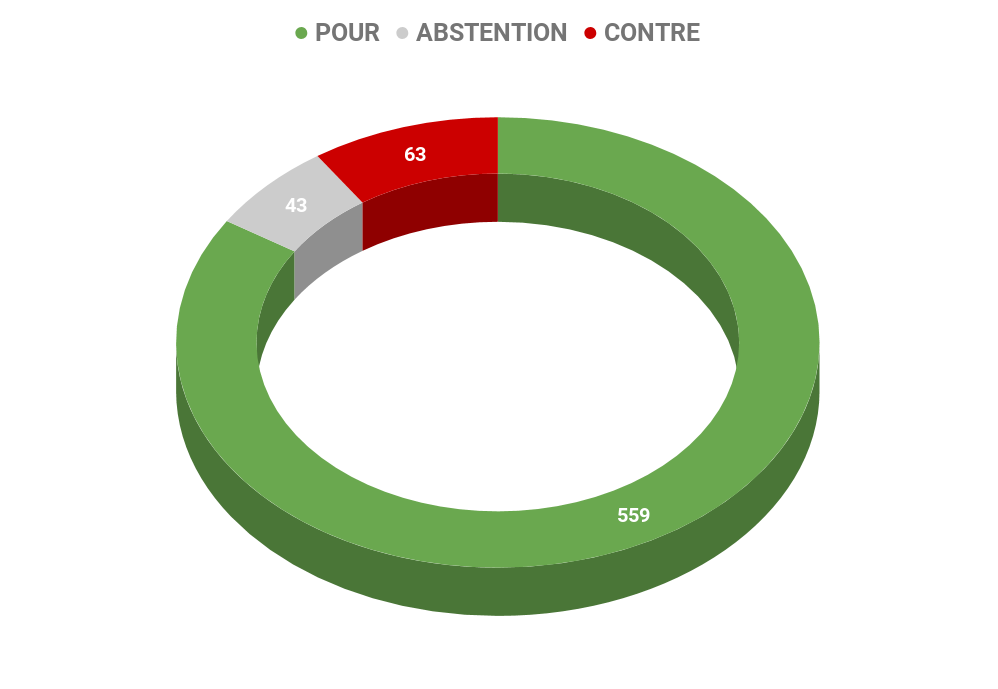

# **Rapport A8-0005/2018** Accélérer l’innovation pour une énergie propre

## La recherche et l'innovation au service de la politique énergétique européenne

La construction de l'Union de l'énergie est essentielle pour continuer à stimuler la recherche, le développement et l'innovation. Cette Union de l'énergie permettra d'optimiser la pénétration sur le marché des nouvelles technologies propres dans toutes les régions de l'Union, en réalisant des économies d'échelle et en accroissant la sécurité au niveau de la réglementation et de l'investissement.

L'Union européenne doit pouvoir tirer pleinement profit des opportunités offertes par les innovations énergétiques non polluantes sur le plan technologique. Dans cette perspective, ce plan de financements permettra de **favoriser l'efficacité énergétique, l'utilisation durable et à faible taux d'émission des sources d'énergie ainsi que des solutions et des technologies décentralisées pour la production, le stockage et le transport de l'énergie**.

## Envoyer des signaux forts pour les investisseurs  

Les énergies propres sont des énergies dont la production et la consommation n'occasionnent que de très faibles émissions de gaz à effet de serre et autres polluants. Les objectifs de l'accord de Paris, supposent **une deuxième moitié du XXIe siècle quasiment neutre en carbone**. Pour le secteur de l'énergie, les combustibles fossiles devront donc progressivement faire place aux sources d'énergie à faible intensité carbone, ce qui suppose **une transformation sans précédent des modes de production et de consommation de l'énergie synonyme de milliers de milliards d'euros d'investissements**.

Le financement de cette transition à grande échelle revient avant tout au secteur privé, mais les États et l'Union européenne ont également un rôle déterminant à jouer dans la création d'un cadre politique propice: marchés de l'énergie et du carbone, fiscalité, réglementation, mesures d'incitation, financement d'infrastructures stratégiques, innovation, coordination et information, etc. 

## Accélérer l'innovation pour une énergie propre dans l'Union européenne

L'Union européenne s'est engagée à réduire ses émissions de gaz à effet de serre de 40 % par rapport aux niveaux de 1990 d'ici 2030. Il s'agit d'un engagement charnière dans la transition à long-terme vers une économie à faible intensité de carbone. **L'Union prévoit de réduire ses émissions de carbone de 80 à 95 % à l'horizon 2050**, tandis que l'accord de Paris vise la neutralité carbone à l'échelle mondiale dès la deuxième moitié du XXIe siècle. 

Étant donné que les émissions européennes proviennent majoritairement de la consommation d'énergie, les énergies propres ont un rôle déterminant à jouer dans cette transition. Aussi les politiques de l'Union en matière de climat s'accompagnent-elles de stratégies de promotion des énergies renouvelables et de l'efficacité énergétique

### Assurer une cohérence entre la politique de recherche et développement et la politique énergétique

L'Union européenne reste **un chef de file mondial en matière d'innovation à forte valeur ajoutée, dans le domaine de l'énergie à faible émissions**, y compris dans le domaine de l'efficacité énergétique, des énergies renouvelables et des technologies propres. Elle doit rester ambitieuse dans ses politiques et ses instruments afin **d'envoyer les signaux d'investissement adéquats et de conserver sa position dominante sur le marché mondial **de la recherche et de l'innovation en matière d'énergie propre.

### Garantir un financement continue des innovations énergétiques

Du fait de l'incertitude du marché, de la technologie et de la science, le financement provenant du secteur privé est souvent soit insuffisant soit indisponible. **L'Union européenne doit donc envoyer des signaux forts et concordants en adoptant des mesures incitatives afin de tranquilliser les investisseurs et de stimuler  les investissements privés dans l'innovation, la recherche et le développement** en matière d'énergie propre et dans le déploiement de cette innovation.

Afin de stimuler ces investissements, la volonté européenne est d'accentuer les partenariats entre le secteur privé et les pôles de recherche pour faire émerger les innovations tout en assurant des conditions de concurrence équitables et un marché concurrentiel facilitant l'adoption de nouvelles technologies propres, en particulier dans les domaines de l'efficacité énergétique et des énergies renouvelables.

### Inclure la société civile dans le déploiement de l'innovation énergétique

La libéralisation du secteur de l'énergie et l'accroissement des investissements dans les innovations du secteur doivent se faire **au profit des consommateurs européens qui comptent sur un approvisionnement en énergie abordable en les aidant à bénéficier de tarifs énergétique réduits** et d'un meilleur contrôle de leur consommation et de leur production d'énergie

Dès lors, l'objectif européen est d'inclure la société civile dans le déploiement de l'innovation énergétique en tant que_ prosommateurs_ (contraction de producteur – consommateur), en **permettant à l'ensemble des citoyens de participer à la transition énergétique** tout en rendant cette dernière moins coûteuse.

## Les Recommandations portées par le rapport

### Pour les États membres

*   **Améliorer l'intelligibilité des instruments de financement existants**, comme le Fonds européen pour la promotion de l'efficacité énergétique (FEEE), en matière d'innovation dans l'énergie propre au niveau des Etats membres;
*   **Apporter une contribution adéquate financière et humaine afin d'atteindre l'objectif des 3% du PIB** de l'Union en matière de recherche et de développement;
*   Examiner de manière approfondie les procédures d'enregistrement de brevets en **supprimant les charges administratives inutiles qui ralentissent le processus de pénétration du marché des produits innovants **et nuit au rôle de l'Union en tant que chef de file de la transition pour une énergie propre;
*   Aider les autorités régionales et locales à prendre des mesures coordonnées pour encourager l'innovation énergétique au niveau local et transrégional dans le but de développer des stratégies cohérentes;

### Pour la Commission européenne

*   Poursuivre ses **efforts dans la transversalité de la recherche et de l'innovation, qui s'applique à tous les secteurs sans se limiter aux projets liés à l'énergie** et qui favorise et encourage la production de processus, de service et de marchandises plus efficaces sur le plan énergétique ;
*   Poursuivre l'amélioration du financement de la recherche collaborative dans le cadre du défi de société du programme Horizon 2020 dans le domaine de l'énergie tout en rationalisant l'innovation en matière d'énergie dans les autres défis de société;
*   **Rendre cohérent les fonds concernés par l'innovation**, y compris les fonds structurels consacrés à des projets d'énergie propre tout en améliorant l'intelligibilité des instruments de financement existants au niveau de l'Union européenne.
*   Proposer, dans le cadre de la **politique industrielle de l'Union, une dimension énergétique ciblée**, à long terme et technologiquement neutre fondée sur un rendement énergétique élevée, une libéralisation accrue du marché et une plus grande transparence du secteur;
*   Exploiter tout le potentiel de l'initiative "Mission innovation"[^1] afin que ses membres puissent honorer leur engagement de doubler le financement annuel alloué à la recherche et au développement concernant l'énergie propre entre 2015 et 2020;
*   Elaborer une stratégie globale d'exportation pour des technologies énergétiques durables et propres et des solutions systémiques.

## Résultat des votes

## Quelques sources pour approfondir le sujet… 

* [Lien du rapport ](http://www.europarl.europa.eu/sides/getDoc.do?type=TA&language=FR&reference=P8-TA-2018-0026)

* [Lien vers l'étude du Service de recherche du Parlement européen sur la décarbonisation des transports dans l'Union européenne]("http://www.europarl.europa.eu/RegData/etudes/STUD/2017/601989/IPOL_STU(2017)601989_FR.pdf")

* [Lien vers l'étude du Service de recherche du Parlement européen sur le programme-cadre de l'Union européenne pour la recherche et l'innovation: Évolution et données clés depuis le premier programme-cadre jusqu'à Horizon 2020, dans la perspective du neuvième programme-cadre]("http://www.europarl.europa.eu/RegData/etudes/IDAN/2017/608697/EPRS_IDA(2017)608697_FR.pdf")

* [Lien vers l'étude du Service de recherche du Parlement européen sur la promotion des sources d'énergie renouvelables dans l'UE: Politiques de l'Union et approches des États membres]("http://www.europarl.europa.eu/RegData/etudes/IDAN/2016/583810/EPRS_IDA(2016)583810_FR.pdf")

* [Lien vers le dossier relatif à l'Union de l'énergie sur Touteleurope.eu](https://www.touteleurope.eu/actualite/perspectives-de-la-politique-europeenne-de-l-energie.html) 

* [Lien vers l'actualité pertinente du gouvernement : grands axes pour accélérer le déploiement des énergies renouvelables électriques en France](https://www.ecologique-solidaire.gouv.fr/nicolas-hulot-presente-grands-axes-accelerer-deploiement-des-energies-renouvelables-electriques)

