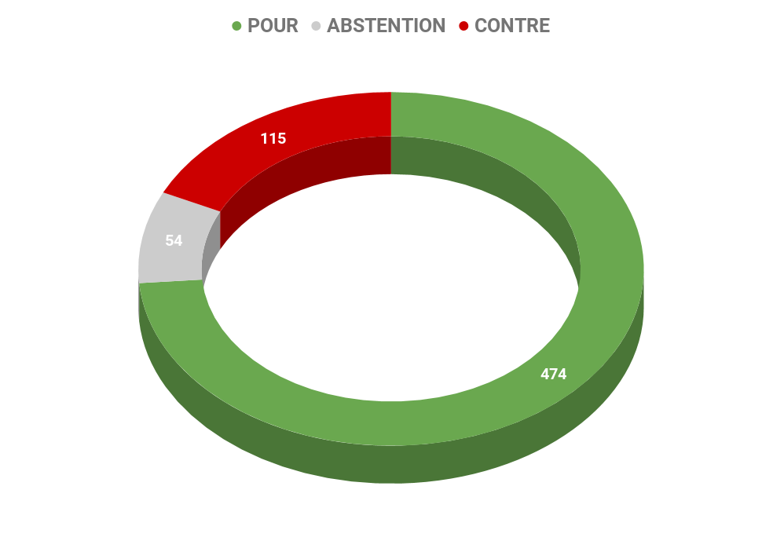
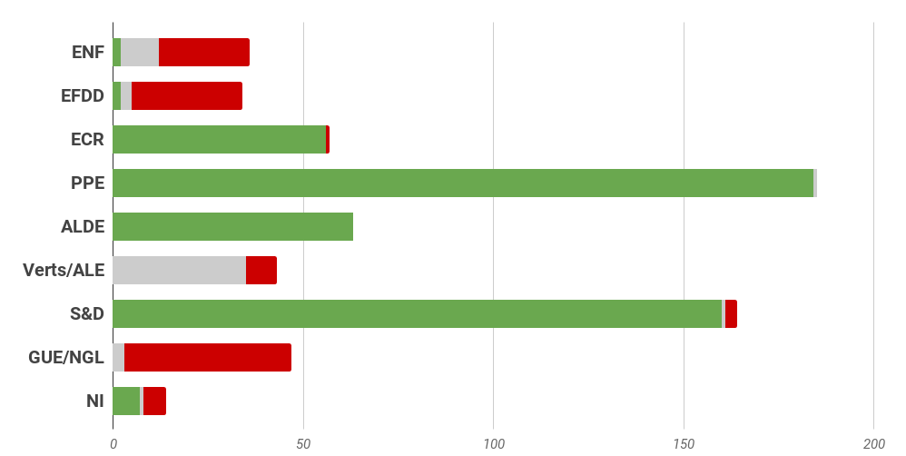
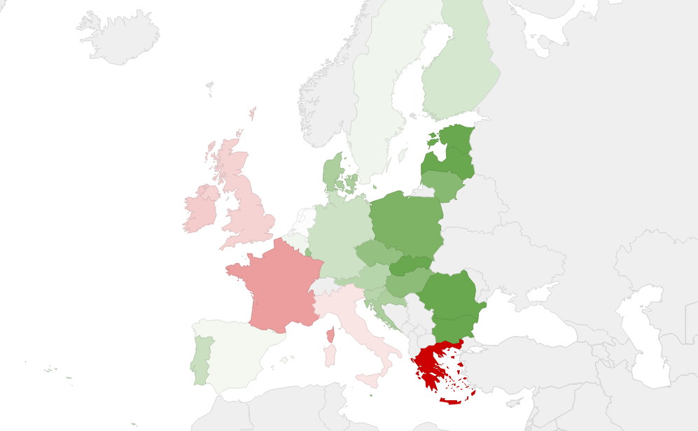

# **Rapport A8-0163/2016** Promotion de l'innovation et du développement économique en rapport avec une gestion agricole d'avenir

## L'agriculture, pilier économique de l'Union européenne

Le secteur agricole est l'un des secteurs économiques les plus dynamiques. En effet, **l'Union européenne est le premier exportateur mondial de produits agricoles, ce qui fait du secteur agroalimentaire un pilier économique de l'Union**, qui emploie 47 millions de personnes au sein de 15 millions d'entreprises actives en aval tant dans la transformation des produits alimentaires que le commerce de détails et les services.

Dans un même temps, le secteur agricole fait également face à de nombreux enjeux économiques, sanitaires et environnementaux. D'un côté les producteurs doivent faire face aux intempéries climatiques, à la raréfaction des ressources naturelles ainsi qu'aux  exigences économiques du marché. De l'autre côté, les consommateurs exigent que la production alimentaire respecte des normes et des valeurs environnementales, nutritionnelles et sanitaires plus strictes et réponde à des exigences de plus en plus élevées en termes de qualité.

Dans cette perspective, **le secteur agricole doit se diversifier et innover pour produire des denrées alimentaires de qualité, sûres et abordables pour tous** les citoyens et pour garantir un revenu décent et viable aux producteurs.

## Renforcer le soutien aux acteurs du monde agricol

L'agriculture durable et innovante, offrant des produits de qualité, contribue à remplir de nombreux objectifs horizontaux du traité sur le fonctionnement de l'Union européenne liés à l'environnement et à la santé. Ce modèle, soutenant l'innovation doit également garantir une concurrence loyale dans cette transition numérique du secteur agricole.

### Soutenir la transition numérique dans le secteur agricole

L'innovation constitue un outil essentiel et une priorité stratégique horizontale fondamentale pour la définition, la mise en œuvre et la réalisation des objectifs de la réforme de la Politique Agricole Commune 2014-2020. Pour répondre aux objectifs climatiques, sans toutefois remettre en question le modèle compétitif du secteur agricole, la Commission européenne a fait le choix **d'intégrer la PAC à la politique de recherche, dans un partenariat européen d'innovation**. Ce partenariat permet de rassembler des exploitants agricoles, des chercheurs, des entreprises ainsi que des associations, afin de promouvoir la productivité et l'efficacité du secteur agricole tout en parvenant à un développement durable de l'agriculture qui puisse assurer un niveau satisfaisant de fonctionnalité des sols.

Le Parlement, en défendant un renforcement de ce partenariat, souhaite également que le développement des nouvelles technologies puisse assurer la transition numérique dans le secteur agricole. Il est ainsi souligné le rôle essentiel du traitement de méga données propres à l'agriculture afin d'assurer un suivi en temps réel et d'améliorer la prise de décision et la gestion des opérations tout au long de la chaîne d'approvisionnement alimentaire.

### S'adapter aux exigences environnementales et sanitaires

Le recours à l'agriculture de précision et aux méga données, par la transition numérique du secteur, permettra ainsi de produire plus avec moins de ressources et de procéder à des interventions plus ciblées pour lutter contre les maladies, les organismes nuisibles sur la production, tout en réduisant le gaspillage alimentaire sur la distribution.

De plus, le soutien aux innovations permet de s'adapter aux aléas climatiques ainsi qu'aux exigences environnementales et sanitaires du secteur agricole. L'intégration des dernières technologies, alliée à l'adaptation et à la réinvention de techniques existantes, y compris de pratiques agro-écologiques et biologique, dans les pratiques agricoles aura ainsi d'importantes retombées positives pour les exploitations de toutes tailles.

### Garantir une concurrence loyale dans le secteur agricole

Les nouveaux modèles d'agricultures, adaptées aux nouvelles technologies, représentent** un potentiel de création d'emplois important pour chaque région**. Sur la production, l'innovation est susceptible d'améliorer la productivité du travail et les revenus en réduisant les coûts de production et en rendant les entreprises plus efficaces dans le secteur agricole. 

Cette transition numérique du secteur agricole doit dès lors s'accompagner d'une réglementation claire et cohérente afin de laisser une marge de manœuvre à l'esprit d'entreprise tout en  assurant une concurrence loyale sur l'ensemble du territoire de l'Union européenne.

## Vers une transition numérique de l'agriculture européenne 

### Pour les États membres

*   Inciter les acteurs du secteur à utiliser des techniques et technologies innovantes pour réduire les pratiques d'irrigation à perte ou pour atténuer les incidences des inondations ;
*   **Soutenir financièrement le secteur agricole pour l'innovation via des investissements dans la recherche publique** en combinant des partenariats public-privé pour tester lancer des produits innovants ;
*   **Créer des synergies entre acteurs du secteur agricole pour innover et répondre aux enjeux de l'économie circulaire**, concept économique qui s'inscrit dans le cadre du développement durable et dont l'objectif est de produire des biens et des services tout en limitant la consommation et le gaspillage des matières premières, de l'eau et des sources d'énergie;
*   Garantir le** respect des exigences environnementales** européennes dans le secteur agricole.

### Pour la Commission européenne

*   Proposer des solutions pour **promouvoir l'adoption de systèmes de gestion agricole sur les technologies de l'information et de la communication**, le suivi des données en temps réel et la technologie des capteurs ainsi que l'utilisation des systèmes de détection pour l'optimisation des systèmes de production ou l'agriculture de précision ;
*   **Soutenir les pratiques innovantes et le partage de bonnes pratiques telles que les systèmes de rotation des cultures**, de couvertures permanentes des sols, de limitation du travail des sols, ou la fertilisation au moyen de légumineuse vertes et de bactéries fixatrices d'azote pour éviter toute nouvelle dégradation des sols ;
*   Publier un rapport bisannuel sur les incidences du financement et d'autres mesures prises par l'Union à l'égard de l'innovation agricole sur l'évolution du coût et du prix de revient des produits agricoles ainsi que sur les perspectives d'avenir financières et économiques pour les exploitations agricoles familiales dans l'Union;
*   Adopter une stratégie globale plus ambitieuse sur l'innovation dans le secteur agricole ;
*   Procéder à** un examen approfondi des nouvelles compétences nécessaires à la gestion des entreprises agricoles **européennes de demain ;
*   Garantir les conditions de concurrence véritablement équitables pour le secteur agricole tout en s'assurant que la législation environnementale en la matière soit entièrement respectée dans les différents Etats membres.

## Résultat des votes

## Quelques sources pour approfondir le sujet… 

* [Lien du rapport ](http://www.europarl.europa.eu/sides/getDoc.do?pubRef=-//EP//NONSGML+REPORT+A8-2016-0163+0+DOC+PDF+V0//FR)

* [Lien vers l'étude du Service de recherche du Parlement européen sur l'agriculture de précision et l'avenir de l'agriculture en Europe ](http://www.europarl.europa.eu/RegData/etudes/STUD/2016/581892/EPRS_STU581892_FR.pdf)

* [Lien vers le dossier PAC 2014-2020 sur Touteleurope.eu ](https://www.touteleurope.eu/actualite/la-pac-2014-2020.html)

* [Lien vers l'actualité pertinente du gouvernement : appel à projets « concours d'innovation » dans le secteur agricole](http://agriculture.gouv.fr/appel-projets-concours-dinnovation)

 