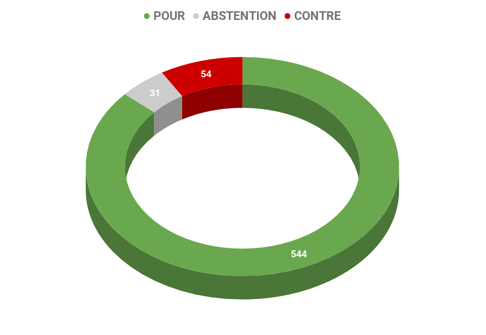
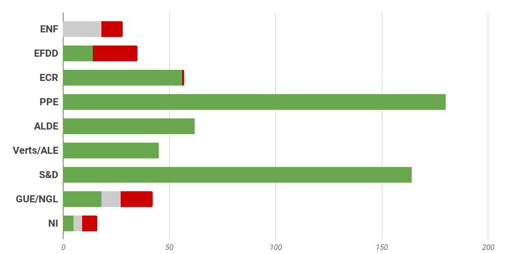
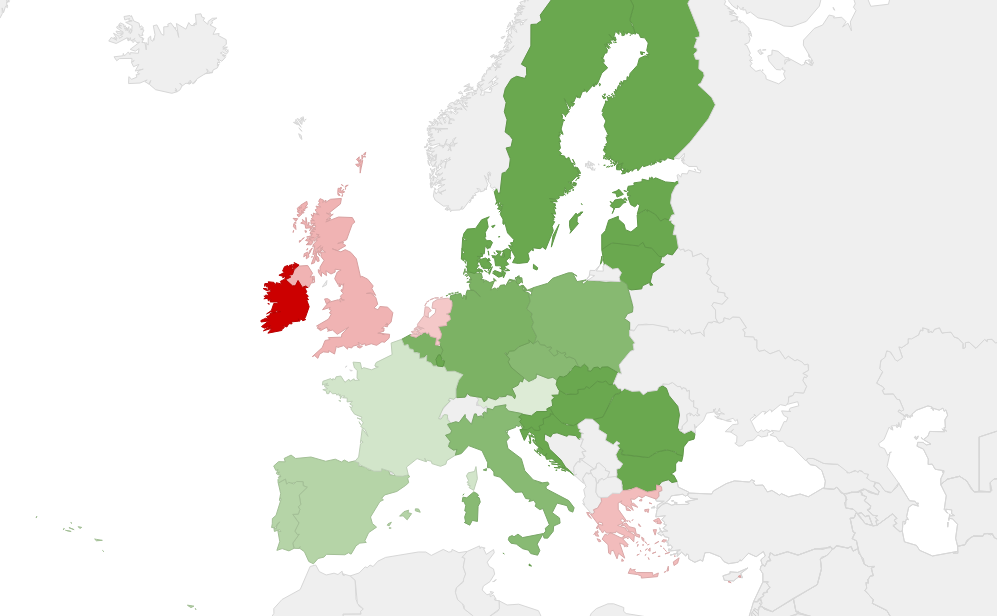

# **Rapport A8-0258/2017** Système d'échange de quotas d'émission 

*Maintenance de l'actuelle restriction du champ d'application pour les activités aériennes et préparation pour la mise en oeuvre d'un mécanisme de marché mondial à partir de 2021*

## Soutenir l'effort international

La **forte croissance des émissions de gaz à effet de serre (GES) du secteur de l'aviation** risque de saper les efforts déployés par l'Union et à l'échelle mondiale pour lutter efficacement contre le changement climatique. La pierre angulaire de ce cadre d'action est l'objectif contraignant de **réduction de l'ensemble des émissions de gaz à effet de serre de l'UE d'au moins 40%** par rapport aux niveaux de 1990 d'ici à 2030. Pour ce faire, en 2005, l'Union européenne a notamment mis en place un [système d'échange de quotas d'émission](https://ec.europa.eu/clima/policies/ets_fr#tab-0-0) (SEQE) qui fonctionne selon le principe du plafonnement et des échanges. **Un [plafond](https://ec.europa.eu/clima/policies/ets/cap_en) est fixé pour limiter le niveau total de certains gaz à effet de serre** qui peuvent être émis par les installations couvertes par le système. **Dans les limites de ce plafond, les entreprises[ reçoivent](https://ec.europa.eu/clima/policies/ets/allowances_en) ou[ achètent](https://ec.europa.eu/clima/policies/ets/auctioning_en) des quotas d'émission** **qu'elles peuvent échanger avec d'autres entreprises** en fonction de leurs besoins. C'est le plafonnement du nombre total de quotas disponibles qui garantit la valeur de ceux-ci.

Afin de faire progresser les négociations au sein de l'Organisation de l'aviation civile internationale (OACI), l'Union a adopté deux dérogations temporaires à la [directive 2003/87/CE](http://eur-lex.europa.eu/legal-content/FR/TXT/PDF/?uri=CELEX:02003L0087-20151029&qid=1488376254029&from=FR) établissant le SEQE, de manière à limiter les obligations de mise en conformité incombant aux exploitants d'aéronefs aux **seules émissions des vols entre des aérodromes situés dans l'Espace économique européen** (EEE).

En octobre 2016, l'OACI a approuvé une résolution sur un **régime mondial de mesures basées sur le marché afin de limiter l'augmentation des émissions de l'aviation** internationale à partir de 2021 au moyen d'un système de compensation visant à permettre la réalisation de l'objectif de stabilisation des émissions de l'aviation internationale aux niveaux de 2020.

## Objectif du rapport 

Le règlement a pour objectif la prolongation des limitations actuelles du champ d'application du système d'échange de quotas d'émission (SEQE) de l'UE pour les activités aériennes jusqu'au 31 décembre 2023 et la préparation de la mise en œuvre d'un mécanisme de marché mondial à partir de 2021.

**Pour atteindre les objectifs fixés par l'accord de Paris sur le changement climatique, et dont le Parlement européen a adopté la ratification le 4 octobre 2016, tous les secteurs devront apporter leur contribution**. Des mesures devront donc être prises par le biais de l'Organisation de l'aviation civile internationale (OACI) pour **réduire les émissions du secteur de l'aviation internationale**.

Les travaux menés par l'OACI en vue d'un **mécanisme de marché pour les émissions de l'aviation internationale** constituent un élément du «train de mesures» visant à atteindre l'objectif indicatif d'une croissance neutre en carbone à compter de 2020. Dans ce contexte, le présent règlement modifiant la [directive 2003/87/CE](http://eur-lex.europa.eu/legal-content/FR/TXT/?qid=1518201046729&uri=CELEX:02003L0087-20171229) a pour objectif de **prolonger les limitations actuelles** du champ d'application du système d'échange de quotas d'émission (SEQE) de l'UE pour les vols non intra-EEE (Espace économique européen) **jusqu'au 31 décembre 2023** pour permettre d'acquérir l'expérience nécessaire pour la mise en œuvre d'un mécanisme de marché mondial à partir de 2021.

## Faire du secteur aérien européen un acteur de la transition climatique

### Au niveau des États membres

*   Mise aux enchères de 15 % des quotas à compter du 1er janvier 2013. En ce qui concerne l'activité au cours de la période allant du 1er  janvier 2017 au 31 décembre 2023, les États membres devraient publier avant le 1er septembre 2018 le nombre de quotas pour le secteur alloués à chaque exploitant d'aéronefs
*   Les recettes tirées de la mise aux enchères des quotas devront servir à:
    *   La **lutte contre le changement climatique **dans l'Union et dans les pays tiers, 
    *   Au financement de **projets communs visant à réduire les émissions de gaz à effet de serre du secteur de l'aviation**, tels que l'entreprise commune pour la réalisation du système européen de nouvelle génération pour la gestion du trafic aérien ([SESAR](http://www.europarl.europa.eu/oeil/popups/ficheprocedure.do?lang=fr&reference=2005/0235(CNS))), les initiatives technologiques conjointes [Clean Sky](http://www.europarl.europa.eu/oeil/popups/ficheprocedure.do?lang=fr&reference=2013/0244(NLE)) 
*   Le produit de la mise aux enchères pourra aussi servir à financer les contributions au **Fonds mondial pour la promotion de l'efficacité énergétique et des énergies renouvelables**, ainsi que des mesures visant à éviter le déboisement.

### Pour la Commission européenne

*   À partir du 1er janvier 2021, il conviendra de **réduire chaque année le nombre de quotas alloués aux exploitants d'aéronefs** conformément au facteur de réduction linéaire applicable à tous les autres secteurs relevant du SEQE de l'UE ;
*   Toute allocation de quotas pour des activités aériennes à destination et en provenance d'aérodromes situés dans des pays en dehors de l'Espace économique européen (EEE) après le 31 décembre 2023 devra faire l'objet d'un réexamen,
*   Avant que le mécanisme de marché mondial ne devienne opérationnel, la Commission devra **présenter un rapport sur les moyens de mettre ces instruments en œuvre** dans le droit de l'Union.

## Résultat des votes

## Quelques sources pour approfondir le sujet…

*   [Résolution législative du Parlement européen](http://www.europarl.europa.eu/sides/getDoc.do?pubRef=-//EP//NONSGML+TA+P8-TA-2017-0477+0+DOC+PDF+V0//FR) 
*   [Le règlement européen texte adopté ](http://eur-lex.europa.eu/legal-content/FR/TXT/?uri=CELEX:32017R2392)
*   Toute l'Europe: [Émissions de gaz à effet de serre : l'Europe ne progresse plus](https://www.touteleurope.eu/actualite/climat-quel-bilan-pour-l-action-europeenne-2-ans-apres-la-cop21.html) et** **[Dossier sur la lutte contre le changement climatique ](https://www.touteleurope.eu/actualite/la-lutte-contre-le-changement-climatique.html)
*   Représentation de la France à l'OACI [L'Assemblée de l'OACI adopte une résolution historique relative à un mécanisme mondial pour la compensation des émissions de CO2 de l'aviation internationale](https://oaci.delegfrance.org/L-Assemblee-de-l-OACI-adopte-une-resolution-historique-relative-a-un-mecanisme)

