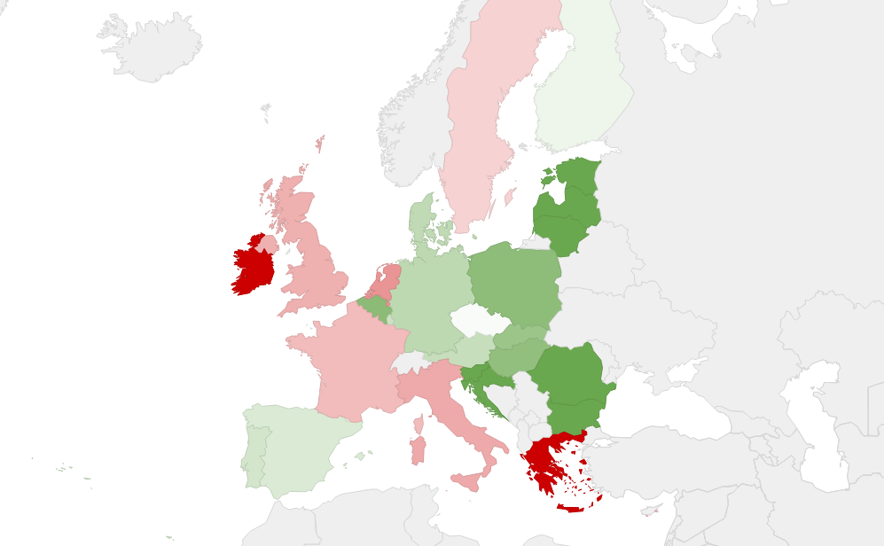

# **Rapport A8-0198/2017** Prolongement du Fonds Européen pour les Investissements Stratégiques (Plan Juncker)

## Un plan d'investissement pour l'Europe pour relancer la croissance

En 2014, la Commission a proposé de mettre en place un plan d'investissement, le Plan Juncker, qui devait pendant 3 ans mobiliser 315 milliards d'euros à investir dans l'économie réelle. Cette mesure devait enrayer la baisse des investissement en Europe depuis 2008 (-15% par an). Ce plan a permis de **financer depuis 2015 de grands projets d'infrastructures (transport, numérique, énergie…) mais également des projets liés à l'éducation, la culture ou encore la recherche et l'innovation**. Les entreprises (PME et ETI) ont également pu en bénéficier directement  par un système de caution bancaire directement assuré par la Banque européenne d'investissement pour les projets innovants. Fort de ce succès, la Commission européenne a proposé de **prolonger la dynamique jusqu'en 2020 et de porter le montant du plan à 500 milliards d'euros**. 

## Evaluer le plan initial et améliorer son fonctionnement

Les eurodéputés ont rappelé que **le Plan Juncker et les projets qu'il finance doivent avant tout profiter à la création d'emplois dans l'Union européenne, à soutenir une croissance durable et contenir une part de risque plus élevés que la normale**. Ce rappel vise à préciser les contours de "l'additionnalité", c'est-à-dire que les projets entrant dans le périmètre du Plan Juncker ne doivent **pas être éligibles à d'autres fonds de soutien à l'activité afin de ne pas laisser s'installer un "effet d'aubaine"** chez les bénéficiaires. Ainsi, les eurodéputés préconisent de privilégier des activités spéciales en raison du risque inhérents à un Etat membre, un secteur économique ou une région ; mais également, des projets d'infrastructure qui auraient un caractère transfrontalier. 

## Plus de transparence et d'équité géographique

L'évaluation du plan initial et les conditions de son prolongement ont amené les eurodéputés à se prononcer en faveur d'une amélioration de la gouvernance du fonds, et d'une meilleure péréquation dans la sélection des projets financés. 

### Une gouvernance plus transparente et des conditions d'attribution des fonds liées aux priorités de l'Union

Les règles d'attribution des fonds aux projets bénéficiaires ont été jugées trop opaques par les eurodéputés qui ont notamment demandé que la gouvernance du fonds soit modifiée. Ils ont notamment recommandé : 

*   que les structures de gouvernance s'efforce de** garantir une parité femmes-hommes** dans les organes directeurs 
*   que le comité de pilotage du fonds comprenne un expert nommé par le Parlement européen qui agirait en toute indépendance, et ne bénéficierait pas d'un droit de vote ; et que chaque membre **veille à prévenir les conflits d'intérêts** ; 
*   que les décisions prises par le comité d'investissement soient transmises au Parlement européen, au Conseil et à la Commission, avec un état des lieux de la mise en oeuvre de ces décisions. 

Concernant les critères de sélection des projets bénéficiaires, les eurodéputés ont souhaité qu'ils soient compatibles avec les politiques de l'Union européen et ont mis l'accent sur : 

*   les infrastructures ferroviaires et portuaires ;
*   la technologie de chaîne, l'internet des objets et les domaines relatifs à la cybersécurité et les infrastructures de protection des réseaux ; 
*   les industries culturelles et créatives en lien avec le programme "Europe créative" {voir fiche correspondante}. 

### Une diversification géographique des projets financés et une éthique de l'investissement

L'évaluation de la mise en oeuvre de la première version du Plan Juncker a mis en avant le fait que les principaux bénéficiaires du plan Juncker sont la France, l'Allemagne, les Pays-Bas, la Pologne ou encore le Royaume-Uni. Pour permettre à tous les Etats de bénéficier du fonds, les eurodéputés ont notamment :

*   soutenu la proposition initiale de la Commission de classer les pays bénéficiaires en rapportant les investissements au PIB des pays ; 
*   encouragé la mise en place **d'une plateforme de conseil en investissement qui donnerait des conseils techniques aux Etats membres ne disposant pas de la capacité administrative** d'initier des opérations bénéficiaires du fonds ; 
*   proposé que la Banque européenne d'investissement s'efforce de **mettre en place des accords de coopération dans chaque Etat membre** ; 
*   demandé à ce que les organisations de pilotage du fonds ne concluent **pas d'accord avec des entités établie dans des pays ou territoires considérés comme non coopératifs ou à risques, ou qui ne se conformeraient pas aux normes fiscales** de l'Union européenne (c'est-à-dire les paradis fiscaux). 

## Résultat des votes

## Quelques sources pour approfondir le sujet… 

*   Rapport final : [☍ suivre le lien](http://www.europarl.europa.eu/sides/getDoc.do?pubRef=-//EP//TEXT+REPORT+A8-2017-0198+0+DOC+XML+V0//FR) 
*   Le réglement : 
    *   Proposition initiale de la Commission européenne : 
        *   Texte complet : [☍ suivre le lien]("http://www.europarl.europa.eu/RegData/docs_autres_institutions/commission_europeenne/com/2016/0597/COM_COM(2016)0597_FR.pdf") 
        *   Résumé : [☍ suivre le lien](http://www.europarl.europa.eu/oeil/popups/summary.do?id=1451788&t=e&l=fr) 
    *   Texte officiel en vigueur : 
        *   Texte complet : [☍ suivre le lien](http://eur-lex.europa.eu/legal-content/EN/TXT/?uri=CELEX:32017R2396) 
        *   Résumé : [☍ suivre le lien](http://www.europarl.europa.eu/oeil/popups/summary.do?id=1517609&t=f&l=fr) 
*   Dossier correspondant sur *touteleurope.eu*
    *   Les financements européens accessibles aux entreprises : [☍ suivre le lien](https://www.touteleurope.eu/actualite/les-financements-europeens-accessibles-aux-entreprises.html) 
    *   Qu'est-ce que le plan Juncker : [☍ suivre le lien](https://www.touteleurope.eu/actualite/qu-est-ce-que-le-plan-juncker.html) 
