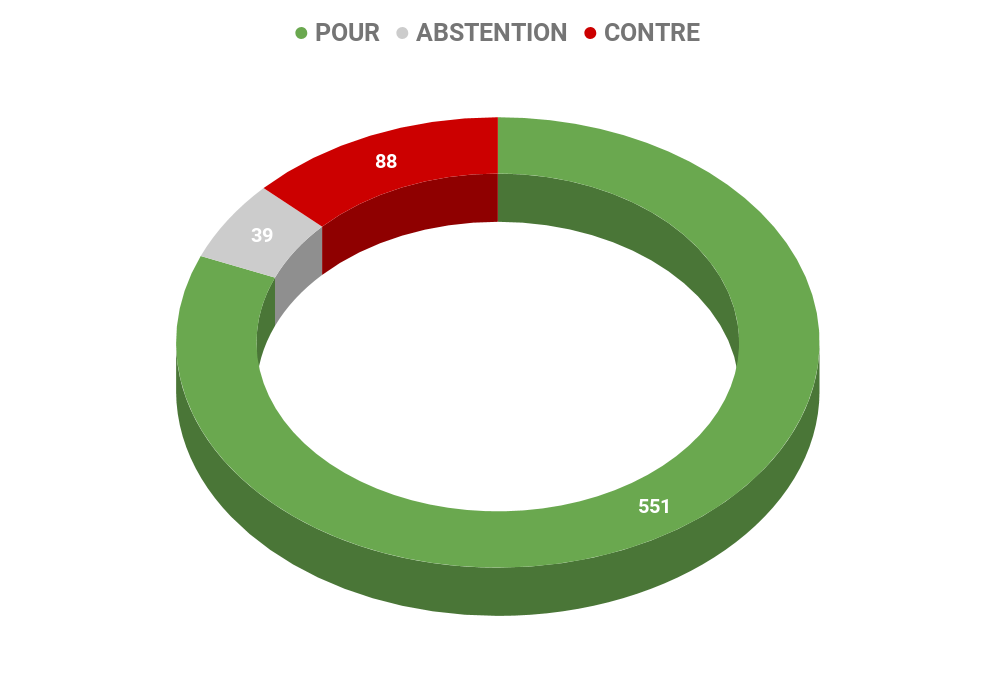
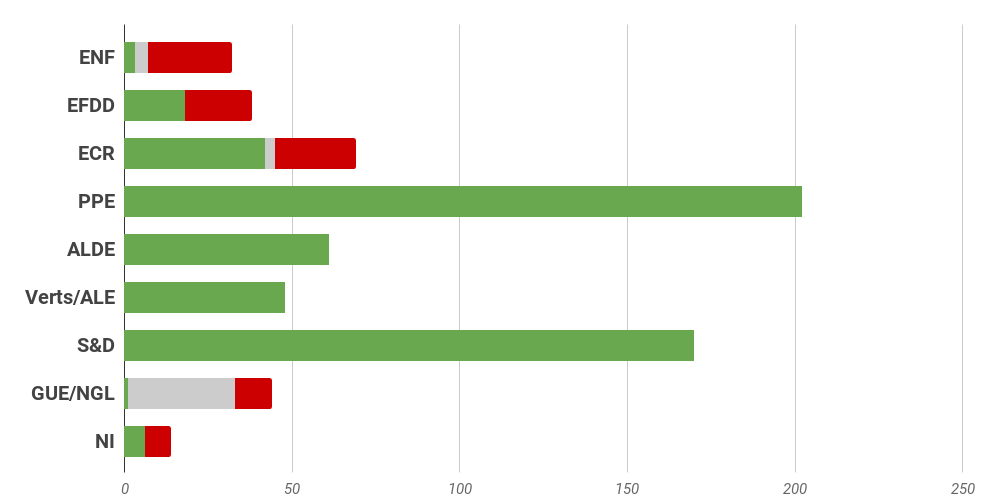
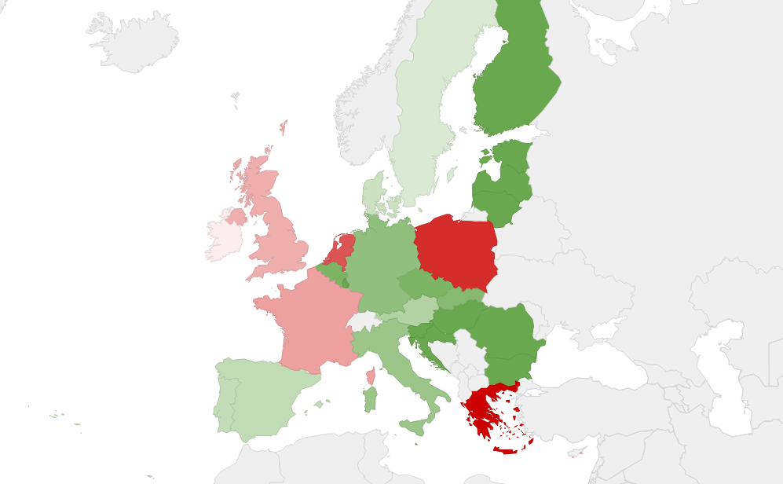

# **Rapport A8-0371/2015** Vers un acte sur le marché unique numérique 

## Vers un Acte sur le Marché unique numérique

Le Parlement soumet à la Commission et aux États membres une liste de propositions dont il considère qu'elles sont une priorité pour permettre à l'Union d'exploiter le potentiel de la transition numérique au bénéfice des utilisateurs et des entreprises. Il insiste sur l'urgence de créer un cadre harmonisé au niveau européen permettant de susciter une confiance dans l'usage des services numériques à l'échelle du continent. Tous les aspects du numérique sont abordés concomitamment afin de renforcer la cohérence de l'action de l'Union. Ainsi, l'investissement dans les infrastructures permettant un accès rapide et sûr au réseau dans toute l'Union est encouragé, les règles fixant les droits et obligations de l'ensemble des acteurs de l'écosystème sont modernisées, des orientations concernant le fonctionnement de nouveaux types d'activités sont proposées. 

## Objectif du rapport / Mission des députés

Les députés doivent mettre en avant les priorités, souligner les domaines dans lesquels l'action de l'Union est attendue, inciter les Etats membres à mettre en œuvre les textes existants et leurs mesures d'accompagnement. Ils confirment dans tous ces cas les grandes orientations des politiques de l'Union qui doivent :

 
### S'adapter aux changements technologiques 

Pour cela, l'Union doit adapter ses règles juridiques pour les rendre efficaces à l'ère numérique. Le Parlement propose d'appliquer dans tous les textes le principe de « neutralité technologique » en vertu duquel toutes les innovations techniques sont traitées de manière identique afin que seules les plus performantes ne soient exploitées.

### Préserver les droits des utilisateurs

Le Parlement souligne l'impact du numérique sur tous les aspects de la vie, notamment le travail, la santé, la citoyenneté, la vie privée. Il demande que soient systématiquement pris en compte tous ces aspects, lorsque des textes sont proposés et discutés. Il insiste particulièrement sur la nécessité de mettre en place un cadre juridique protecteur pour les consommateurs qui serait à la fois bénéfique pour ceux-ci et pour les entreprises qui profiteraient d'une confiance accrue se traduisant par une consommation en ligne plus importante. Il rappelle l'importance de la bonne application d'un cadre complet garantissant à tous les Européens un niveau élevé de protection des données.

### Servir un modèle de société ouvert et juste

Le Parlement met en avant le potentiel d'innovation et d'émancipation qu'internet génère en offrant un accès non contraint à un réseau mondial. Ce potentiel ne doit pas être empêché mais il faut veiller à ce qu'internet ne soit pas un environnement favorisant l'illégalité. Il faut également veiller à maintenir les équilibres de marché. Les règles en matière de concurrence doivent donc s'appliquer, tout comme celles permettant une répartition plus équitable des ressources par le biais de la fiscalité.

### S'assurer que l'ouverture se fasse en parallèle à la protection de la diversité

Celle-ci serait défendue par une réglementation favorisant les contenus audiovisuels produits sur le continent. Elle permettrait également aux États de maintenir des modes de financement et de diffusion favorables à la diversité culturelle et linguistique de l'Union. La modernisation du droit d'auteur doit également favoriser et justement rémunérer la création tout en en permettant la diffusion le plus large possible.

### Permettre aux entreprises de toutes tailles de tirer profit des nouvelles technologies

Outre l'encouragement de l'activité commerciale en ligne par l'adaptation des règles communes, les entreprises bénéficieraient d'investissements importants dans les infrastructures et la formation. Les mesures coordonnées en faveur du renforcement de la cybersécurité sont également primordiales pour que les entreprises puissent opérer en toute sérénité. L'accès aux résultats de la recherche financée par les pouvoirs publics devrait également permettre aux entreprises européennes, y compris les plus petites, de bénéficier et d'exploiter les innovations dans le domaine dans lequel elles exercent une activité.

## Les Recommandations portées par le rapport

### Pour les États membres

* Mettre en place une administration en ligne
*	Rendre accessibles par défaut les données publiques
*	Investir dans les infrastructures, notamment les réseaux ultrarapides.
*	Renforcer la coopération pour lutter contre les activités illégales sur internet
*	Renforcer la coordination en matière de lutte contre la fraude fiscale, notamment la TVA
*	Soutenir le développement de l'économie collaborative en adaptant les politiques sociales et d'emploi.
*	Coopérer dans le domaine de la cybersécurité
*	Favoriser l'acquisition des compétences numériques dès l'école.

### Pour la Commission européenne

*	Répertorier et supprimer les obstacles au commerce électronique
*	Préserver internet comme plateforme de communication mondiale ouverte, neutre, sûre, inclusive
*	Adapter le droit des contrats transnationaux au contexte numérique
*	Assurer le fonctionnement de systèmes de règlement des litiges transfrontaliers en ligne
*	Interdir le blocage géographique des contenus en ligne 
*	Poursuivre la réforme du droit d'auteur en en assurant son équilibre
*	Moderniser le cadre réglementaire encadrant les services de média audiovisuels pour prendre compte des nouvelles pratiques de visualisation.

## Résultat des votes

## Quelques sources pour approfondir le sujet… 

* Le rapport d'initiative du Parlement européen : [☍ suivre le lien](http://www.europarl.europa.eu/sides/getDoc.do?pubRef=-//EP//TEXT+REPORT+A8-2015-0371+0+DOC+XML+V0//FR)
* Dossier *Toute l'Europe* sur l'état des lieux du marché unique du numérique : [☍ suivre le lien](https://www.touteleurope.eu/actualite/marche-unique-numerique-un-etat-des-lieux.html)
* L'actualité numérique du gouvernement : [☍ suivre le lien](https://www.numerique.gouv.fr/europe-et-international)
