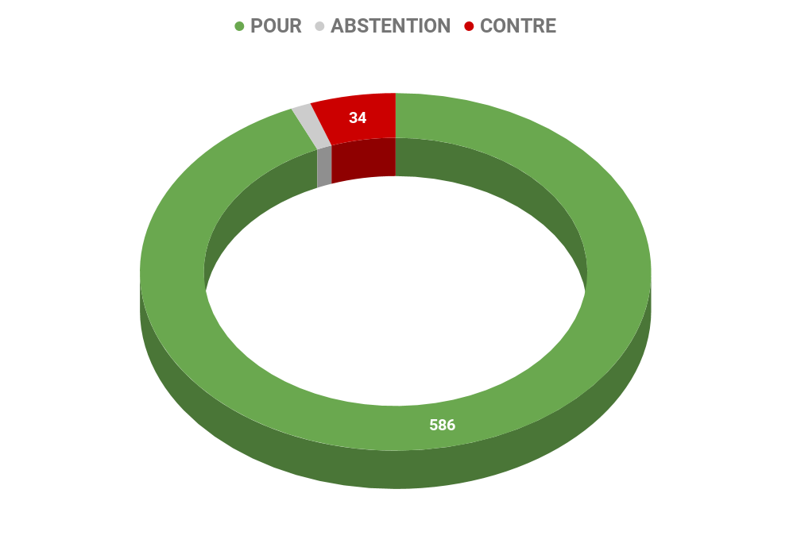
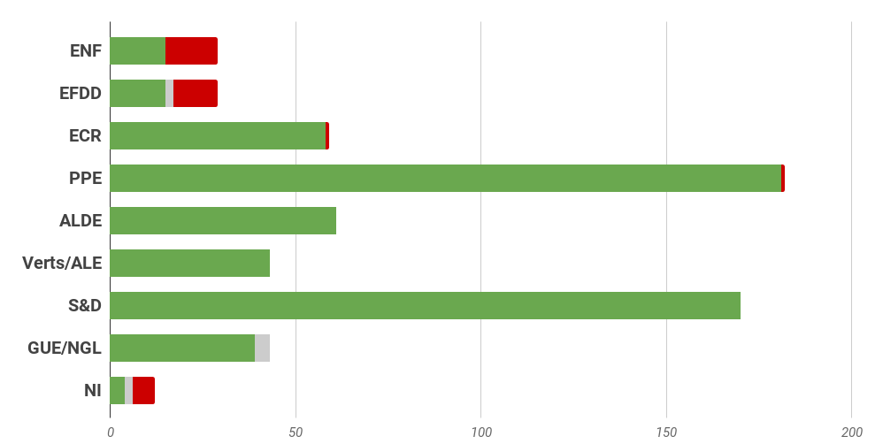
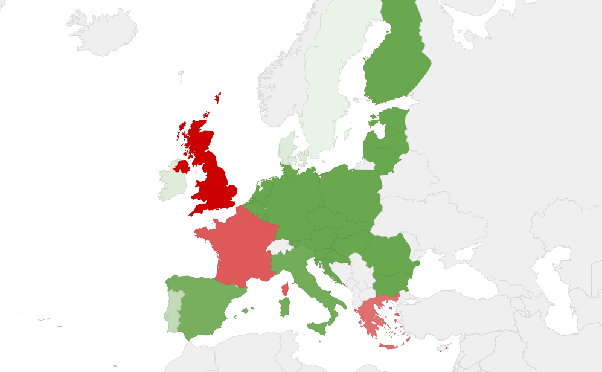

# **Rapport A8-0378/2016** Portabilité transfrontière des services de contenu en ligne dans le marché intérieur

## Favoriser l'accès aux mêmes contenus en ligne pour tous les Européens

Avec le développement rapide des services de contenu en ligne et l'utilisation croissante des appareils portables, y compris à l'étranger, **les Européens s'attendent aujourd'hui à pouvoir utiliser leurs services de contenu en ligne où qu'ils se trouvent dans l'Union** (portabilité transfrontière). Or, il est courant que les personnes qui voyagent à l'intérieur de l'Union soient entièrement ou partiellement privées de cette possibilité. Le fait que la portabilité transfrontière des contenus en ligne dans l'Union ne soit pas ou soit mal assurée résulte des pratiques d'octroi de licences des titulaires de droits et des pratiques commerciales de fournisseurs de services. 

Le règlement proposé sur lequel doivent se prononcer les eurodéputés s'attache à garantir une approche commune notamment grâce à des définitions qui devraient être interprétées de manière uniforme dans l'Union :
*   l'*abonné* est défini en tant que consommateur qui, en vertu d'un contrat de fourniture d'un service de contenu en ligne conclu avec un fournisseur, peut avoir accès à ce service et l'utiliser dans son État membre de résidence ;
*   un *consommateur* est défini comme toute personne physique qui, dans les contrats relevant du règlement, agit à des fins qui n'entrent pas dans le cadre de son activité commerciale, industrielle, artisanale ou libérale.
*   Un «service de contenu en ligne» serait couvert par la proposition si :
 * i) le service est proposé légalement dans l'État membre de résidence;
 * ii) le service est proposé sur une base portable;
 * iii) il s'agit d'un service de médias audiovisuels ou d'un service qui consiste essentiellement en un accès à des œuvres ou à d'autres objets ou en des transmissions par des organismes de radiodiffusion.

## Contre l'assignation à résidence des contenus en ligne 

La [stratégie pour un marché unique numérique](http://www.europarl.europa.eu/oeil/popups/ficheprocedure.do?reference=2015/2147(INI)&l=fr) (lien vers la synthèse correspondante) met en avant une série d'initiatives dans le but de créer un marché intérieur des contenus et services numériques. La présente proposition est l'une des premières initiatives dans le cadre de cette stratégie. Selon la Commission, elle devrait avoir des effets positifs sur la compétitivité car elle favorise l'innovation dans le domaine des services de contenu en ligne et attirera davantage de consommateurs vers ces services. 

### Une approche commune de la portabilité

Le Parlement européen souhaite une approche commune qui doit permettre aux abonnés de services de contenu en ligne (type Spotify, Deezer, Netflix,...) auxquels ils ont souscrits dans leur État de résidence puissent en bénéficier n'importe où dans l'Union, sans frais supplémentaire, sous-réserve d'une vérification de l'effectivité de la résidence du consommateur. Par exemple,** il ne devrait pas être possible pour une personne résidant en France de s'abonner au service en allemagne. Mais tout souscripteur résidant en Allemagne, doit pouvoir utiliser son service en France, et inversement**. 

### Le lieu de résidence stable au coeur de la bataille pour les droits d'auteur

Les droits d'auteurs reversés par les services de contenu en ligne diffèrent selon les règles nationales, ainsi l'utilisation par un Français d'un contenu en Allemagne pose la question de savoir le régime applicable. 

Ainsi les eurodéputés préconisent deux approches : 
*   le cas où les titulaires **des droits d'auteur autorisent une utilisation "sans frontière"** : ils peuvent toujours autoriser la fourniture de leur contenu, l'accès à celui-ci et son utilisation sans vérification de l'État membre de résidence. Dans ce cas, le contrat entre le fournisseur et l'abonné pour la fourniture du service serait suffisant pour déterminer l'État membre de résidence de l'abonné.
*   le cas où les titulaires sont dans une approche différenciée :** le fournisseur de service en ligne doit prendre des mesures raisonnables pour vérifier l'État de résidence de l'abonné**. Il devait ainsi utiliser au maximum deux moyens de vérification tels que une carte d'identité ou des moyens d'identification électroniques, les coordonnées bancaires, le lieu d'installation d'un terminal d'abonné, un contrat pour la fourniture d'accès à l'internet ou la fourniture d'un service de téléphonie, une facture de service public de l'abonné, ou encore un contrôle de l'adresse IP de l'abonné. 

Dans le cas où l'abonné ne fournirait pas les informations requises, les fournisseurs pourraient empêcher l'utilisation du service dans un autre Etat membre que celui où il a souscrit. 

## Résultat des votes

## Quelques sources pour approfondir le sujet… 

*   Proposition de la Commission : [☍ suivre le lien](http://www.europarl.europa.eu/RegData/docs_autres_institutions/commission_europeenne/com/2015/0627/COM_COM(2015)0627_FR.pdf) 
*   Rapport du PE : [☍ suivre le lien](http://www.europarl.europa.eu/sides/getDoc.do?pubRef=-//EP//NONSGML+REPORT+A8-2016-0378+0+DOC+PDF+V0//FR) 
*   Texte adopté : [☍ suivre le lien](http://eur-lex.europa.eu/legal-content/EN/TXT/?uri=CELEX:32017R1128)  
*   La libre circulation des services et la liberté d'établissement : [☍ suivre le lien](https://www.touteleurope.eu/actualite/la-libre-circulation-des-services-et-la-liberte-d-etablissement.html) 
*   Le géoblocage en Europe : [☍ suivre le lien](https://www.touteleurope.eu/revue-de-presse/netflix-geoblocage-e-commerce-les-propositions-de-la-commission-sur-le-numerique.html) 
*   L'harmonisation du droit d'auteur en Europe : 
    *   [☍ suivre le lien](https://www.lesechos.fr/19/06/2015/lesechos.fr/021150667811_droit-d-auteur---vers-un-marche-unique-en-europe--.htm) 
    *   [☍ suivre le lien](https://fr.unesco.org/news/emmanuel-pierrat-droit-auteur-chantier-toujours-renouvele) 
    *   [☍ suivre le lien](http://la-rem.eu/2016/01/05/apres-amendemeteur-en-europe/) 
