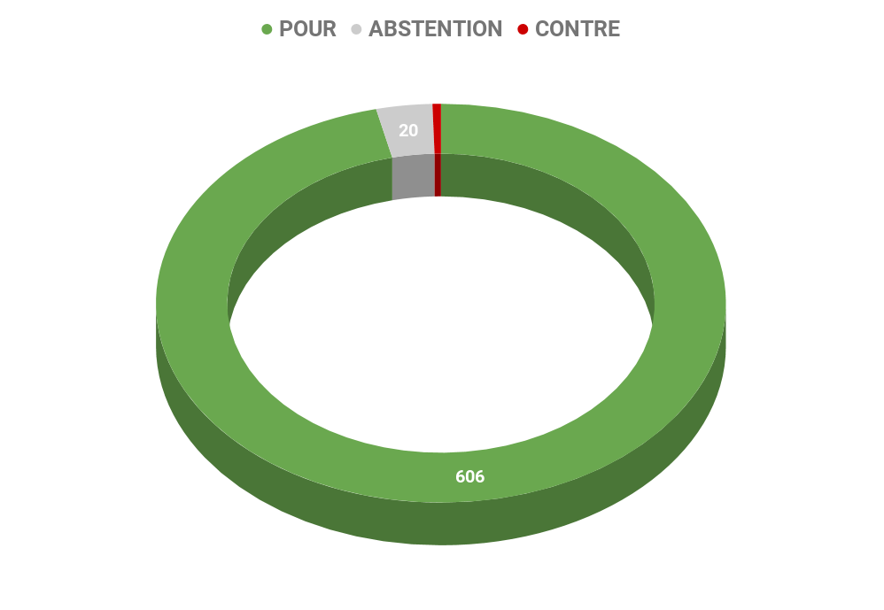

# **Rapport A7-0402/2013** Règlement général sur la protection des données

## Protection et libre circulation des données personnelles dans l'Union

Le texte proposé par la Commission vise à mettre à jour la directive pour la protection des données personnelles adoptée en 1995. Il s'agit à la fois d'adapter le cadre juridique au contexte technique, économique et politique actuel et d'harmoniser les règles qui connaissent encore trop de disparités entre les États membres de l'Union. L'objectif principal est d'assurer un haut niveau de protection pour les utilisateurs tout en permettant aux entreprises de l'Union d'exploiter le potentiel d'innovation qu'offre l'utilisation légale, loyale et sécurisée des données que les services qu'elles fournissent visent à collecter et exploiter.

## Objectif du rapport / Mission des députés

Le rapport soumis au vote vise à l'adoption d'un texte qui est le résultat de plus de trois ans de négociations entre le Parlement, le Conseil et la Commission. Dans le rapport final soumis aux eurodéputés, le niveau de protection des données est rehaussé et le cadre général est davantage harmonisé afin de :

### S'adapter aux changements technologiques et économiques

Le numérique est au cœur de notre économie et de nos sociétés. Le rapport souligne le volume, la valeur et la vitesse sans précédent qui caractérisent le traitement des données aujourd'hui. L'adoption d'un cadre harmonisé, général et précis applicable au niveau européen est essentielle pour permettre à l'Union d'exploiter le potentiel de cette ressource nouvelle dans le respect des droits de chacun. Le rapport confirme donc la pertinence de l'adoption d'un règlement (qui remplace une directive) dont il demande qu'il soit le plus détaillé possible afin de garantir un maximum de sécurité juridique pour tous les acteurs concernés.

### Renforcer le droit des personnes à la protection de leur vie privée

Le rapport rappelle qu'il est plus que jamais essentiel de garantir la protection du droit fondamental à la vie privée. Il propose pour cela de renforcer les moyens pour les sujets de contrôler la protection de ce droit, notamment en leur donnant plus d'informations au moment de l'expression de leur consentement, en leur permettant de garder un contrôle sur leurs données une fois cédées, en leur octroyant la possibilité de rectifier une information sur leur personne si sa diffusion n'est plus justifiée (« droit à l'oubli »), en leur proposant des voies de recours si des violations sont constatées. Dans ce but, des personnes responsables de la protection des données (les « délégués à la protection des données ») vers qui les particuliers pourront se tourner seront clairement identifiées dans les entreprises qui auront collecté et qui traiteront des données.

### Soutenir l'innovation fondée sur les données

L'émergence de ce nouveau marché a permis à des services innovants de se développer. Le rapport propose des solutions pour garantir leur viabilité. Il prévoit de réduire les charges administratives jusqu'à présent imposées pour le traitement des données. Il encourage le recours à des technologies favorisant la protection de la vie privée dès la conception (par exemple des systèmes d'anonymisation). Il soutient le développement de modèles de certification et de labellisation permettant aux acteurs vertueux de faire de leurs bonnes pratiques une véritable valeur ajoutée.

### Prendre en compte la dimension internationale de l'économie de la donnée

Le rapport propose notamment un élargissement du champ d'application permettant de mieux encadrer le traitement des données par des entreprises dont le siège social est situé en dehors de l'Union mais dont les activités sont dirigées vers celle-ci. Il prévoit également des mécanismes plus stricts permettant à des entreprises de transférer des données vers l'étranger. Ce type d'opération ne pourra être fait que s'il est prouvé qu'un niveau de protection équivalent est assuré dans le pays vers lequel ces données sont envoyées pour être traitées.

### Assurer une meilleure application et un meilleur contrôle

La délégation de pouvoirs et de moyens supplémentaires aux autorités nationales de protection des données (ex. CNIL) est proposée dans le rapport. Celles-ci bénéficieraient ainsi de plus de moyens d'investigation et de sanction. Elles opéreraient de manière décentralisée mais leur coordination serait assurée par le renforcement de l'instance européenne au sein de laquelle elles sont amenées à coopérer.

## Les Recommandations portées par le rapport

Le rapport demande que le niveau de protection prévu dans la proposition de la Commission soit rehaussé. Il propose par ailleurs, que soient exploitées et encouragées des solutions alternatives à la réglementation (labellisation, protection dès la conception, et autres solutions basées sur la technologie).

### Pour les États membres

*	Ils verraient leur cadre national remplacé par le règlement dont ils devront assurer l'application.
*	Ils devront confier les moyens suffisants à leurs autorités nationales de protection des données.
*	Ils devront garantir l'indépendance politique et juridique de ces autorités.

### Pour la Commission européenne

*	Elle devrait renforcer sa proposition du point de vue de la protection la vie privée.
*	Elle devrait veiller à la cohérence avec les autres actes spécifiques adoptés sur ce sujet.
*	Elle devrait davantage déléguer l'exécution administrative du règlement aux autorités nationales de protection des données.

## Résultat des votes

## Quelques sources pour approfondir le sujet… 

*     Lien du rapport : [☍ suivre le lien](http://www.europarl.europa.eu/meetdocs/2009_2014/documents/libe/pr/922/922387/922387fr.pdf)

*      Le dossier *Toute l'Europe* sur la protection des données : [☍ suivre le lien](https://www.touteleurope.eu/actualite/la-protection-des-droits-fondamentaux-donnees-privees-droit-a-l-oubli.html)

*      L'actualité du gouvernement : [☍ suivre le lien](http://www.gouvernement.fr/conseil-des-ministres/2017-12-13/protection-des-donnees-personnelles)

