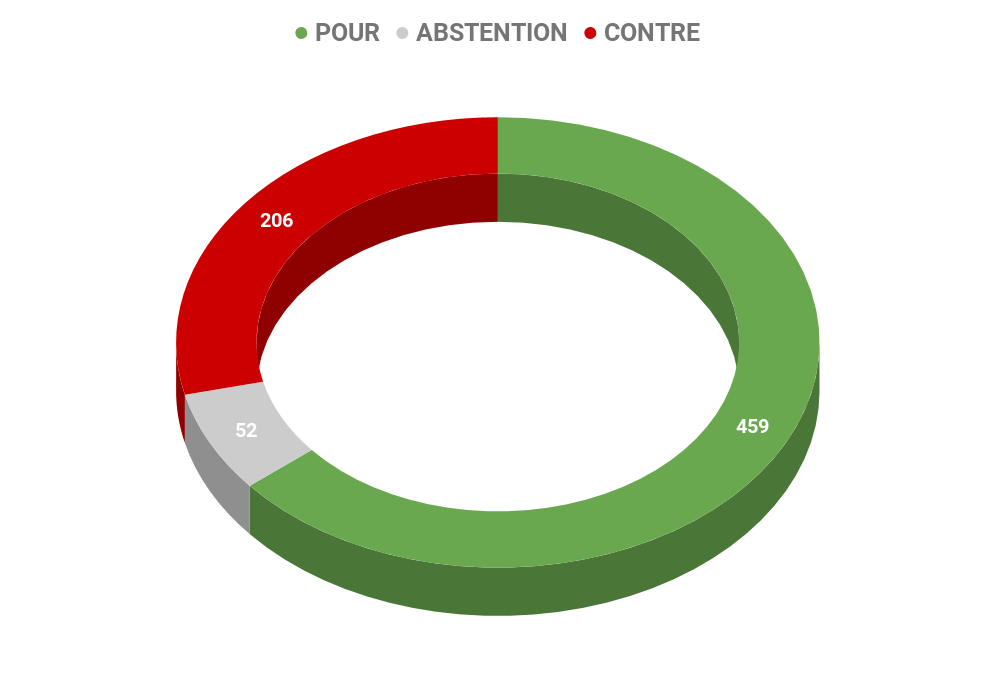
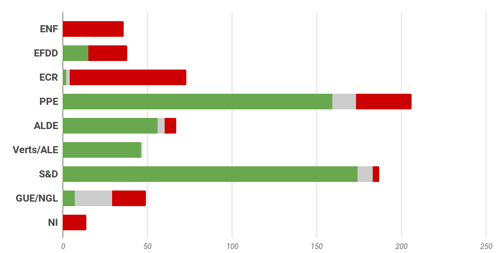
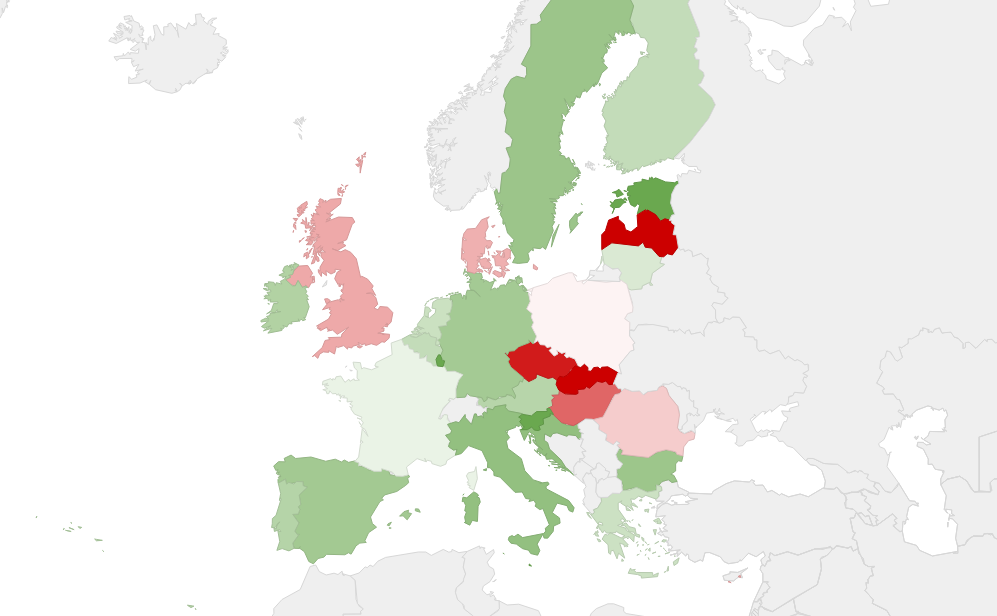

# **Rapport A8-0066/2016** Situation en Méditerranée et nécessité d'une approche globale de l'Union européenne de la question des migrations

### L'Europe à la recherche de réponses à la crise migratoire

L'Europe est confrontée, depuis 2015, a une hausse de l'immigration qui a conduit **l'actuelle crise migratoire**. Ces dernières années, des millions de personnes ont rejoint l'Europe pour fuir la guerre, la terreur ou la persécution dans leur pays. En 2015 et 2016, **plus de 2,5 millions de personnes ont demandé l'asile dans l'Union européenne.** En 2015, **2,2 millions de personnes ont été repérées en situation irrégulière** dans l'Union européenne, elles ne sont plus que 984 000 en 2016.

En 2016, 362 753 personnes ont rejoint l'Union européenne par la Méditerranée, dont 5 022 sont portées disparues ou mortes en mer. En 2017, ce sont 172 000 personnes qui ont traversé la Méditerranée et 3200 personnes qui auraient perdu la vie, et déjà plus de 800 morts depuis le début de 2018.

La crise des migrants a mis en lumière les **faiblesses du système d'asile de l'Union européenne** et la nécessité pour l'Union européenne de travailler, avec les Etats membres, à des réponses globales pour faire face à cette situation inédite. La Commission européenne a ainsi proposé toute une série de mesures d'urgence et à plus long terme, pour **revoir la politique migratoire européenne**, la plupart de ces textes législatives sont en cours de négociation entre le Parlement européen et le Conseil, et notamment la réforme du système de Dublin.

### Mieux prendre en compte les pressions migratoires et garantir l'équité et la solidarité 

Les députés reconnaissent **l'échec du système d'asile européen** à faire face au nombre toujours croissant d'arrivées de migrants, et demandent une **réforme radicale des règles dites de Dublin** (ce qui est en cours depuis), estimant que le critère selon lequel c'est l'Etat membre de première entrée qui est responsable de l'examen de la demande de protection internationale doit être révisé. Ils proposent **de créer un système européen central pour rassembler et répartir les demandes d'asile**. Le système, qui pourrait inclure un quota pour chaque État membre de l'UE, fonctionnerait sur la base de points d'accès ("hotspots") à partir desquels les réfugiés seraient répartis.

Les députés insistent également sur la nécessité d'une **approche législative contraignante et obligatoire en ce qui concerne les réinstallations**. Le rapport rappelle que les États membres doivent remplir leurs obligations sur les **mesures de relocalisation d'urgence**. Une aide technique mais aussi financière devrait être octroyée aux États membres de première arrivée, comme l'Italie et la Grèce, afin d'assurer un meilleur fonctionnement des « hot spots ».

Les députés demandent aussi des **accords de "réadmission" (**retour) à l'échelle européenne qui, selon eux, devraient passer avant les accords bilatéraux entre États membres et pays tiers. Ils insistent sur le fait que le retour de migrants devrait uniquement être effectué si le pays dans lequel ils sont renvoyés est sûr pour eux. Ils souhaitent aussi qu'une **distinction claire soit faite entre les personnes qui sont sur le sol européen de façon clandestine et illégale et celles qui sont victimes de traite**.

Enfin, le Parlement européen souligne la **situation particulièrement vulnérable des mineurs**, et rappelle le droit de chaque enfant d'être traité avant tout comme tel. Il se félicite aussi des fonds supplémentaires alloués par la Commission européenne pour faire face à cette crise. 

### Coordonner et assister les Etats membres dans leur gestion de la migration

*   **Respecter et d'appliquer les mesures de relocalisation** qui prévoient des transferts depuis la Grèce et l'Italie vers d'autres Etats membres, tout en prenant en compte autant que possible les préférences des demandeurs d'asile;
*   **Renforcer les capacités en matière de sauvetage et recherche en mer **en mobilisant davantage de ressources financières et matérielles; 
*   Adopter un **dispositif législatif contraignant et obligatoire pour la réinstallation à l'échelle européenne **pour les réfugiés et les personnes ayant besoin d'une protection internationale;
*   **Renforcer les mesures d'intégration** pour les ressortissants de pays tiers en situation régulière avec une aide qui devrait inclure un logement, des cours de langues, un dialogue interculturel, une formation professionnelle et un accès aux structures démocratiques de la société;
*   **Harmoniser la liste des pays d'origine sûrs**;
*   **Appliquer avec plus d'efficacité les mesures européennes prévues aux frontières extérieures** ;
*   Avoir une meilleure reconnaissance mutuelle des décisions prises par les autres Etats membres en matière d'asile

### Pour la Commission Européenne

*   Proposer une **révision du règlement Dublin III** pour revenir sur les grands principes d'asile européen commun et sur la question des admissions humanitaires ;
*   Adopter des **mesures durables, fiables et efficaces en matière d'opérations de recherche et de sauvetage en mer** ;
*   Poursuivre son travail sur le corps de garde-frontières européen et de transformer le Bureau européen d'appui en matière d'asile en organe de coordination majeur du régime d'asile européen commun;
*   Poursuivre la **révision ciblée du code frontières Schengen**, estimant que l'espace Schengen est l'une des réalisations majeures de l'intégration européenne ;
*   **Mettre en place les points d'accès** (Hot spots) pour que les Etats concernés reçoivent une aide opérationnelle concrète, **des moyens techniques et financiers doivent être alloués aux Etats de première arrivée** pour qu'ils puissent enregistrer avec efficacité les migrants arrivants;
*   Adopter une stratégie de long terme pour contribuer à faire contrepoids aux facteurs d'incitation au départ dans les pays tiers et **à renforcer la coopération avec les pays tiers **en matière d'asile pour **s'attaquer aux causes profondes des flux de migrants irréguliers** et pour les aider à développer leur système d'asile et d'intégration ; 
*   Revoir les montants disponibles dans le cadre du fonds "Asile, migration et intégration" pour qu'ils soient suffisants jusqu'en 2020 et avoir une meilleure vue d'ensemble des fonds alloués en matière de migration 
*   Envisager la **création d'un système permettant aux victimes de traite et de trafic de se faire connaître et de contribuer à arrêter les auteurs d'infractions**, réviser si nécessaire la législation existante dans ce domaine

## Résultat des votes

## Quelques sources pour approfondir le sujet… 

### Texte final

* Version complète : [☍ suivre le lien](http://www.europarl.europa.eu/sides/getDoc.do?pubRef=-//EP//NONSGML+TA+P8-TA-2016-0102+0+DOC+PDF+V0//FR)

### En savoir plus

* Dossiers correspondants sur *touteleurope.eu* :
 * [☍ suivre le lien](https://www.touteleurope.eu/actualite/asile-et-migrations-dans-l-union-europeenne.html)

 * [☍ suivre le lienl](https://www.touteleurope.eu/actualite/la-politique-d-immigration-de-l-ue-externaliser-la-crise.html)

* Site de la commission européenne : [☍ suivre le lien](https://ec.europa.eu/commission/priorities/migration_fr)

* Articles du Parlement européen: [☍ suivre le lien](http://www.europarl.europa.eu/news/fr/headlines/priorities/20150831TST91035)

* Projet de loi pour une immigration maîtrisée et un droit d'asile effectif: [☍ suivre le lien](http://www.assemblee-nationale.fr/15/projets/pl0714.asp)
