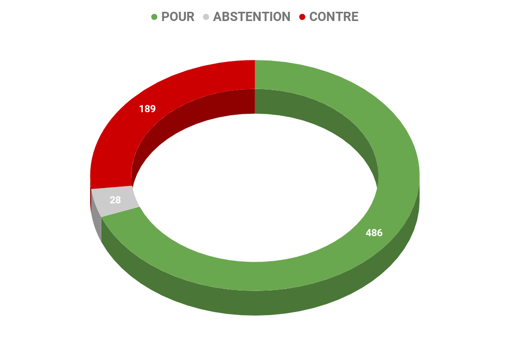
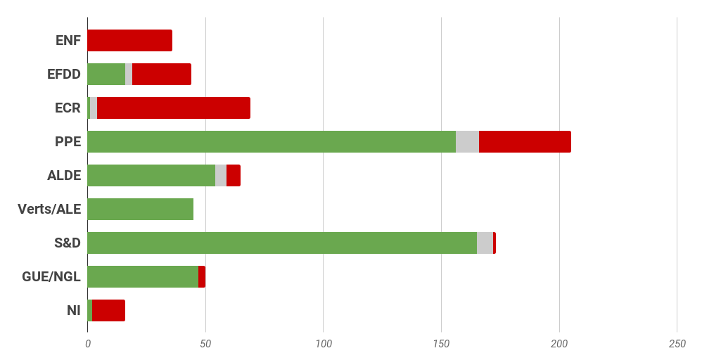
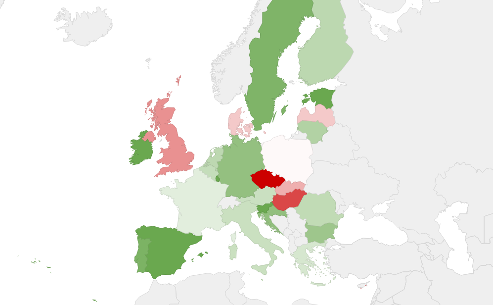

# **Rapport A8-0204/2016** Inclusion et Intégration des Réfugiés

## Défi de la gestion de la crise des réfugiés

Dans le contexte de la crise migratoire qui traverse l'Union européenne depuis 2015, le Parlement européen s'est saisi de ce sujet en faisant valoir la nécessité d'offrir aux réfugiés un accueil digne. 

Suite à l'adoption d'un nouvel Agenda européen en matière de migration en vue de faire face aux difficultés liées à la gestion des flux migratoires dans l'Union européenne. Cet agenda demande notamment des efforts supplémentaires pour **renforcer les capacités en matière de gestion des frontières** et d'opérations de **recherche et de sauvetage** ainsi que pour **mettre à jour le régime d'asile européen** commun, ainsi que l'établissement d'un système européen de relocalisation et de réinstallation.

Dans ce contexte, le Parlement européen considère que **d'autres efforts sont nécessaires pour créer les conditions nécessaires à l'intégration des demandeurs d'asile et des réfugiés dans nos sociétés. **

## Distinguer les migrants économiques et les réfugiés pour apporter des solutions adaptées 

### Donner une définition commune de la notion de réfugié : 

Les eurodéputés soulignent l'importance d'établir une distinction claire entre les réfugiés et les migrants économiques pour la mise en œuvre des différentes politiques européennes et internationales.

### Interroger l'ensemble des domaines relatifs à l'inclusion sociale et l'intégration des réfugiés sur le marché du travail

Ils rejettent la création de marchés de travail spécifiques aux réfugiés et approuvent l'accès des réfugiés aux salaires minimaux respectifs des États membres. Ils rappellent que la directive relative aux conditions que doivent remplir les demandeurs d'asile et la directive relative aux conditions d'accueil prévoient le droit d'accéder au marché du travail et à la formation professionnelle pour les demandeurs d'asile.

### Proposer des pistes pour améliorer l'inclusion sociale et l'intégration des réfugiés sur le marché du travail. 

Ils en appellent à des mesures permettant l'accès des réfugiés et des demandeurs d'asile au logement, aux soins de santé, à l'éducation, à la protection sociale et au marché du travail. Les eurodéputés insistent par ailleurs pour que les États membres veillent à ce que l'accueil de réfugiés aille de pair avec une solide politique d'intégration, incluant des cours de langue et d'orientation, offrant un aperçu exhaustif des valeurs et droits fondamentaux de l'Union et de l'insertion sociale.

Ils rappellent à cet égard l'existence de fonds disponibles pour l'inclusion sociale et l'intégration sur le marché du travail (FSE et FAMI). Mais l'insuffisance de ces fonds suppose des investissements publics accrus et des ressources supplémentaires seront nécessaires. Toutefois, **les mesures d'intégration et d'inclusion destinées aux réfugiés et aux demandeurs d'asile ne devraient pas utiliser les ressources destinées à des programmes ayant pour cible d'autres groupes défavorisés**. 

Ils demandent par ailleurs un redéploiement dans les plus brefs délais des crédits du FSE, du FAMI, du FEDER et du FEAD, afin de mieux aider les États membres qui supportent la charge principale de la crise des réfugiés.

## Principales recommandations pour favoriser l'intégration des réfugiés 

### Pour les Etats membres

*   **garantir une intégration complète et rapide** sur le marché du travail et une inclusion sociale des réfugiés, conformément au principe d'égalité de traitement, **à la situation nationale du marché du travail et à la législation nationale et européenne**;
*   **raccourcir le temps de traitement** des demandes de protection internationale;
*   garantir aux réfugiés et aux demandeurs d'asile un **accès rapide, facile et égal à la formation, y compris à des stages et des apprentissages**, afin de garantir leur intégration rapide, effective et complète;
*   mettre en place des plates-formes spécifiques et des portails internet multilingues qui fournissent des informations précises et aisément accessibles sur les possibilités de reconnaissance des diplômes;
*   faciliter le partage des expériences et pratiques accumulées à l'échelon municipal et à en tirer profit pour promouvoir des marchés du travail favorisant l'insertion de tous les résidents, y compris des bénéficiaires d'une protection internationale, et associer les villes et les autorités locales à l'élaboration et à la mise en œuvre de politiques d'inclusion sociale et économique.

### Pour la Commission

*   envisager une révision ciblée de la directive relative aux conditions d'accueil, afin de **veiller à ce que les personnes** demandant une protection internationale** aient accès au marché du travail le **plus rapidement possible, et** au plus tard 6 mois après le dépôt de leur demande**;
*   encourager une convergence vers le haut des normes de protection sociale et une délivrance rapide des permis de travail dans les États membres;
*   redoubler d'efforts pour s'assurer que les réfugiés et les demandeurs d'asile aient véritablement accès au marché du travail, notamment en **vérifiant que les États membres n'imposent pas de conditions d'accès à l'emploi trop restrictives**;
*   proposer des lignes directrices visant à répondre à la question de la reconnaissance des qualifications et des compétences existantes des réfugiés;
*   **renforcer les mesures de lutte contre toutes les formes de discrimination, de xénophobie et de racisme**;
*   renforcer le dialogue avec les partenaires sociaux en vue d'identifier les possibilités d'emploi pour les réfugiés;
*   soutenir financièrement les actions transnationales assurant une transférabilité et une adaptabilité des bonnes pratiques – telles que les projets de tutorat et d'encadrement entre pairs.

## Résultat des votes

## Quelques sources pour approfondir le sujet… 

*   Résolution adoptée "Réfugiés: inclusion sociale et intégration sur le marché du travail" : [☍ suivre le lien](http://www.europarl.europa.eu/sides/getDoc.do?pubRef=-//EP//NONSGML+TA+P8-TA-2016-0297+0+DOC+PDF+V0//FR)
*   Toute l'Europe, dossier "Asile et migration dans l'Union européenne" : [☍ suivre le lien](https://www.touteleurope.eu/actualite/asile-et-migrations-dans-l-union-europeenne.html)
*   Projet de loi pour une immigration maîtrisée et un droit d'asile effectif : [☍ suivre le lien](https://www.interieur.gouv.fr/Actualites/L-actu-du-Ministere/Presentation-du-projet-de-loi-asile-et-immigration)
