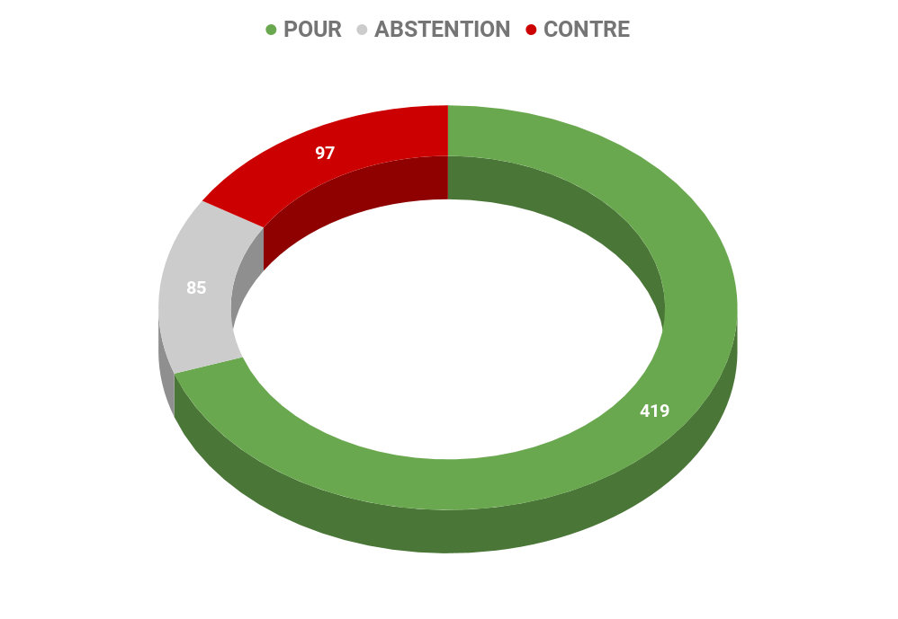
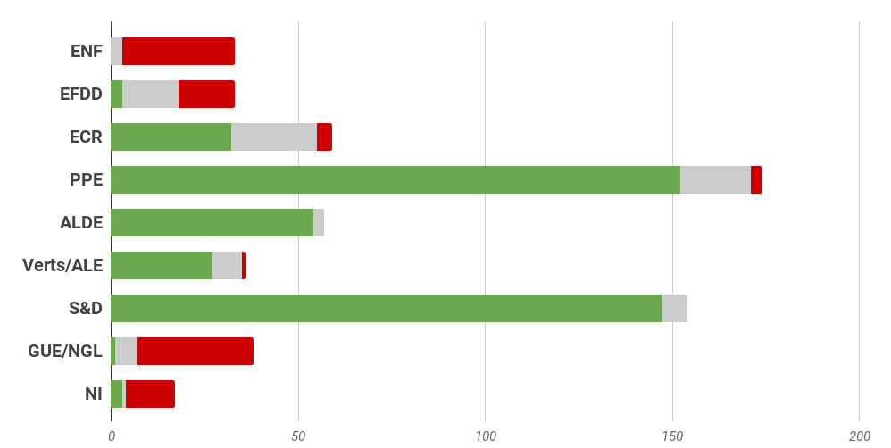
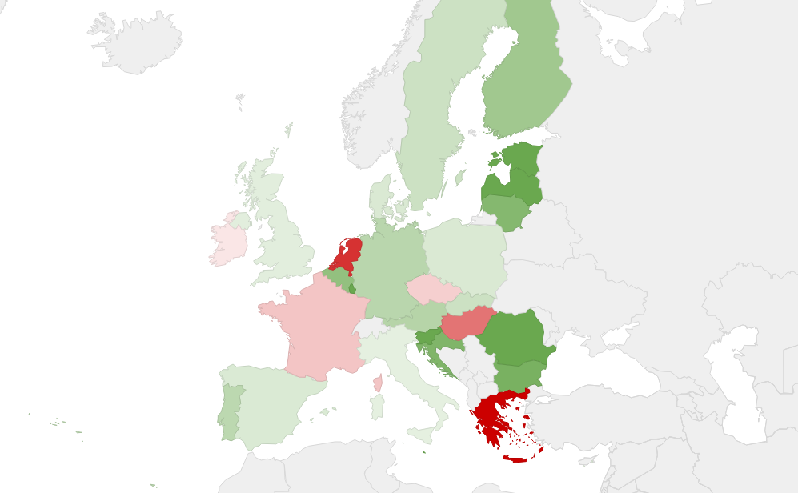

# **Rapport A8-0334/2017** Stratégie UE - Afrique : un coup d'accélérateur au développement

## La redynamisation du partenariat UE - Afrique

Le Parlement appelle à **un dialogue politique intensifié** et recommande que la future coopération porte sur les domaines suivants:
* le développement économique (grâce au commerce et aux accords de partenariat économique, l'intégration régionale, la diversification de l'économie, l'industrialisation durable);
* la bonne gouvernance, notamment les droits de l'homme;
* le développement humain (par l'amélioration de l'éducation, la santé, l'accès à l'eau et à l'assainissement, l'égalité entre les sexes);
* les migrations et la mobilité; et l'environnement, notamment le changement climatique.

## Renforcer le dialogue UE-Afrique pour accompagner les mutations africaines

La redynamisation de la coopération UE - Afrique, dans un contexte de mutation africaine, repose sur un dialogue renforcé entre les deux continents, centrée sur la jeunesse, eu égard à l'importance de celle-ci pour l'avenir des deux continents pour atteindre les objectifs de développement durable[^1].

### Un paysage en mutation en Afrique

La dynamique démographique actuelle du continent est telle qu'**en 2050, la population africaine comptera 2,4 milliards de personnes**, majoritairement des jeunes, tandis que celle de l'Union européenne, qui sera vieillissante, aura chuté à 500 millions de personnes. 

Les projections démographiques en Afrique laissent peu de doutes sur la nécessité absolue de créer des millions de nouveaux emplois. En outre, compte tenu de la taille réduite du secteur formel et de l'absence de système de protection sociale dans la plupart des pays du continent, une majorité de jeunes continuera à se tourner vers l'économie informelle et l'agriculture de subsistance pour subvenir à leurs besoins. Cette croissance démographique offre cependant de potentielles opportunités économiques via la consommation privée, alimentée par l'essor de la classe moyenne. 

Dans un tel contexte africain en mutation, il est clairement dans l'intérêt stratégique de l'Union européenne d'approfondir et d'adapter le partenariat qu'elle a établi de longue date avec les acteurs du continent.

### Le renforcement du dialogue entre l'UE et l'Afrique, condition préalable à un partenariat stratégique renouvelé

Considérant la valeur historique des liens qui unissent l'Union européenne et les pays africains, et le fait que leurs destins soient aujourd'hui étroitement liés, les deux continents ont renforcé au cours des dix dernières années, leur partenariat, fondé sur des valeurs et des intérêts communs, dans le cadre de la stratégie commune Afrique-UE.

Aujourd'hui, l'Union européenne dans son ensemble, est le principal investisseur étranger en Afrique, son principal partenaire commercial, un garant essentiel de la sécurité, sa principale source de transfert de fonds et son premier partenaire dans le domaine du développement et de l'aide humanitaire.

Dans la perspective d'une stratégie commune, le nouveau partenariat UE-Afrique d'Abidjan prévoit la poursuite de trois principaux objectifs :

*   Le développement d'un engagement mutuel et d'une coopération plus accrue sur la scène internationale, sur la base d'un socle de valeurs et d'intérêts communs, y compris dans le cadre des relations bilatérales ;
*   Le renforcement de la sécurité terrestre et maritime des territoires continentaux, et la lutte contre les menaces internes et transnationales, grâce à un investissement dans la sécurité sur les deux continents, tel qu'illustré par le récent investissement de 50 millions d'euros réalisé par l'Union européenne, afin d'assurer le développement de la force G5 Sahel (Mauritanie, Mali, Niger, Burkina Faso, Tchad);
*   Un développement économique durable et inclusif en Afrique, avec pour objectif, la création d'emplois dont le continent a besoin, se traduisant en contrepartie par des possibilités d'investissement économiques pour l'UE ;

Ces problématiques s'inscrivent dans un** contexte de pauvreté important en Afrique, qui compte parmi ses Etats, 33 des 47 pays les moins avancés (PMA)**, et près de 218 millions de personnes vivant dans un état de pauvreté extrême. Le renforcement de la coopération eurafricaine pourrait à cet égard, permettre de répondre aux objectifs de développement durable à l'horizon 2030, en particulier en ce qui concerne l'éradication de la pauvreté.

## Une coopération centrée sur les objectifs de développement durable et focalisée sur la jeunesse

Afin que la résilience sociale, économique et environnementale puisse être réellement envisageable, la nouvelle coopération UE - Afrique repose sur l'engagement à **promouvoir des politiques publiques et des investissements appropriés dans le domaine de la santé, de l'éducation et des droits en matière de sexualité et de procréation**. 

Parce que la jeunesse africaine est une chance, mais également une grande responsabilité, la nouvelle coopération doit aussi se tourner vers l'investissement dans le capital humain afin d'avoir une jeunesse connectée aux réalités mondiales et dotée de compétences qui répondent aux besoins actuels et futurs du marché du travail, en renforçant les systèmes éducatifs et de formation professionnelle, tant formels qu'informels, le travail indépendant et l'entreprenariat.

## Les Recommandations portées par le rapport

### Pour les États membres

*   Respecter l'engagement de **consacrer 0,7 % de leur PIB à l'aide publique au développement **(APD) afin de renforcer la coopération avec l'Afrique;
*   Soutenir les organisations régionales et les autres acteurs politiques pertinents en Afrique dans le domaine de la sécurité, afin de renforcer les capacités des pays en développement, d'y réformer le secteur de la sécurité et de soutenir les actions de désarmement, de démobilisation et de réintégration des anciens combattants; 
*   **Investir davantage dans les domaines de l'énergie renouvelable et de l'économie circulaire **afin de donner un nouvel élan aux actions contribuant au respect de l'environnement et créant de nouveaux emplois;
*   **Coopérer et fournir une assistance aux pays africains qui font face à des mouvements de réfugiés** ou à des situations de crises prolongées en vue d'accroître leurs capacités d'asile et leur système de protection;
*   Accroître leur contribution financière aux fonds fiduciaires et aux autres instruments dont le but est de promouvoir une croissance durable et inclusive et de stimuler la création d'emplois.

### Pour la Commission européenne

*   Renforcer la participation de la société civile dans le partenariat UE - Afrique,
*   Tenir compte, dans ses travaux, des priorités du plan d'action de l'UE contre le trafic d'espèces sauvages en matière de protection de la biodiversité;
*   **Augmenter l'aide apportée à l'agriculture durable, à l'agroforesterie et aux pratiques agroécologiques qui respectent l'utilisation traditionnelle des sols** et garantissent l'accès aux terres, à l'eau et aux semences libres de droits;
*   Soutenir les petits producteurs et agriculteurs et les pâtres pour qu'ils puissent** bénéficier de la sécurité alimentaire**, en construisant des infrastructures et en investissant dans celles-ci;
*   Soutenir la coopération Sud-Sud qui reflète la réalité de la transformation progressive du continent africain;
*   Renforcer, en coopération avec l'Union Africaine les systèmes éducatifs nationaux en Afrique, y compris la capacité de leur structure administrative, en investissant au moins 20% du budget national dans ces systèmes et en **augmentant la contribution de l'UE au Partenariat mondial pour l'éducation et au fonds «L'éducation ne peut pas attendre»**;
*   **Promouvoir les échanges entre étudiants, enseignants, entrepreneurs et chercheurs** des deux continents.

## Résultat des votes

## Quelques sources pour approfondir le sujet… 

*    Lien du rapport : [☍ suivre le lien](http://www.europarl.europa.eu/sides/getDoc.do?pubRef=-//EP//NONSGML+TA+P8-TA-2017-0448+0+DOC+PDF+V0//FR)

*    Lien sur le site du partenariat UE - Afrique : [☍ suivre le lien](https://www.africa-eu-partnership.org/fr)

*    Fiche technique du Parlement européen sur l'Afrique : [☍ suivre le lien](http://www.europarl.europa.eu/RegData/etudes/fiches_techniques/2017/N54404/04A_FT(2017)N54404_FR.pdf)

*    Briefing du Parlement européen sur les nouvelles priorités de la coopération entre l'Union européenne et l'Afrique : [☍ suivre le lien](http://www.europarl.europa.eu/RegData/etudes/ATAG/2017/608824/EPRS_ATA(2017)608824_FR.pdf)

*    Briefing du Parlement européen sur l'émancipation de la jeunesse africaine, nouveau pôle d'attention de la coopération UE-Afrique : [☍ suivre le lien](http://www.europarl.europa.eu/RegData/etudes/BRIE/2017/608806/EPRS_BRI(2017)608806_FR.pdf)

*    Lien vers le dossier relatif au fonctionnement de la politique européenne de développement sur Touteleurope.eu : [☍ suivre le lien](https://www.touteleurope.eu/actualite/le-fonctionnement-de-la-politique-europeenne-de-developpement.html)

*    Lien vers l'actualité pertinente du gouvernement : participation au 5e sommet Union africaine - UE, Novembre 2017, Abidjan : ][☍ suivre le lien](http://www.consilium.europa.eu/fr/meetings/international-summit/2017/11/29-30/)
