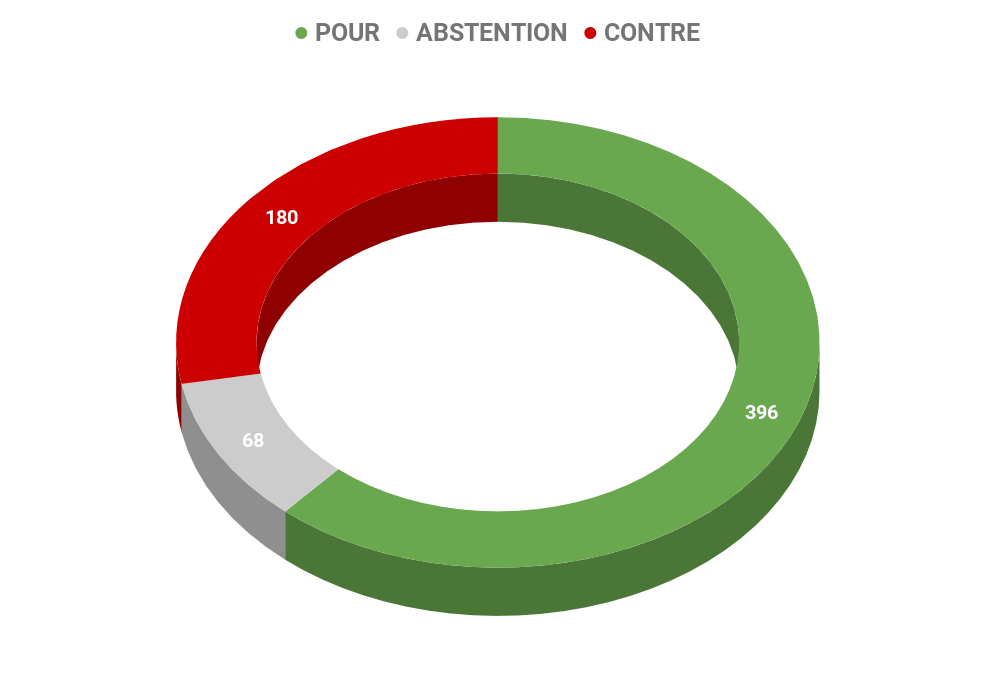
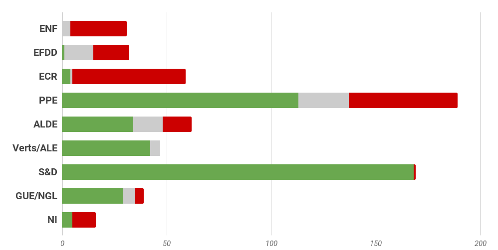
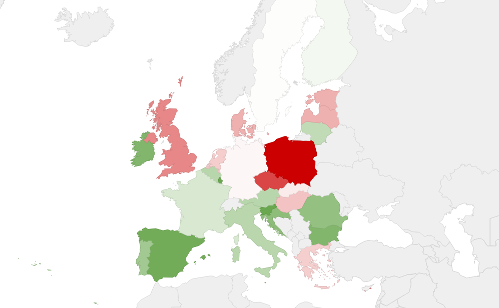

# **Rapport A8-0391/2016** Socle européen de droits sociaux 

## Un socle européen de droits sociaux, vers une une Europe plus sociale?

La Commission est parfois critiquée pour être trop libérale, trop portée sur la concurrence et le marché et pas suffisamment sur les droits sociaux, l'accès au marché du travail ou l'égalité des chances. Pour répondre à ces critiques et craintes récurrentes, elle décide de lancer une **consultation en mars 2016** qui débouche, un an plus tard, sur une **proposition listant  20 principes pour une Europe sociale. **

**Ce socle réaffirme certains des droits déjà énoncés dans l'acquis de l'Union**, et y ajoute de nouveaux principes pour relever les défis issus des évolutions sociétales, technologiques et économiques. Trois chapitres composent le document final : "égalité des chances et accès au marché du travail", "conditions de travail équitables" et "protection sociale et insertion sociale". Parmi les 20 principes : l'égalité entre les femmes et les hommes, l'encouragement du dialogue social, un salaire minimum dans chaque État adapté aux conditions économiques nationales, la lutte contre les travailleurs pauvres ou encore le droit à une protection sociale adéquate et le droit à un logement pour les sans-abris. **L'objectif du socle européen des droits sociaux est de donner aux citoyens des droits nouveaux et plus efficaces**. 

## Développer un modèle social européen ancré dans une économie sociale de marché

Les députés européens souhaitent, au travers de ce rapport d'initiative, défendre leur point de vue sur l'Europe sociale, réaffirmer certains grands principes et contribuer à la définition du socle européen des droits sociaux. Ils considèrent notamment que l'Union européenne devrait continuer **à développer un modèle social européen qui soit ancré dans une économie sociale de marché** et apporter une réponse forte et concrète au sentiment d'inquiétude grandissant en Europe en raison de perspectives d'avenir incertaines, du chômage, des inégalités croissantes et du manque de possibilités, notamment chez les plus jeunes.

Ils rappellent également que l'Europe a promu **des normes de travail et des systèmes de protection sociale bien supérieures** au reste du monde et ils considèrent que ce débat pourra donner des fondations plus solides au projet européen, en réaffirmant également les valeurs fondamentales européennes. Ils insistent sur le fait que les **politiques sociales et économiques doivent être au service de la population** et que le **dialogue social** peut contribuer à la croissance, l'emploi et la compétitivité en Europe. 

Certaines des propositions formulées par le Parlement européen ont été reprises dans la proposition de la Commission européenne sur le socle européen des droits sociaux: égalité entre les femmes et les hommes, soutien actif à l'emploi, égalité des chances, salaires, protection sociale, accès aux services essentiels,…

## La protection sociale au coeur des préoccupations des eurodéputés

### Pour les États membres 

*   Appliquer correctement la législation sur le droit à des conditions de travail saines et sûres
*   Faire respecter le **droit à un logement adéquat** en assurant l'accès à un logement de qualité et abordable 
*   Prendre des mesures pour améliorer la **portabilité des droits sociaux **acquis dans des activités différentes, notamment en réorganisant les régimes de sécurité sociale
*   Achever la **transposition des directives sur l'égalité d'emploi" et l'égalité de race"** visant à garantir l'absence de discrimination et l'égalité des chances sur le marché du travail 
*   **Signer et ratifier la charte sociale européenne révisée** et **la convention européenne de sécurité sociale**
*   Veiller à assurer un niveau approprié d'**investissements sociaux**

### Pour la Commission européenne et les partenaires sociaux 

*   **Présenter une feuille de route échelonnant des mesures concrètes pour que le socle soit mis en oeuvre rapidement et de façon efficace**
*   **Renforcer les droits sociaux au moyen d'outils concrets et spécifiques **: législation, mécanismes d'élaboration des politiques, instruments financiers. Le socle de droits sociaux ne doit pas être qu'une déclaration de principes. 
*   **Appliquer les normes sociales** et de travail qui seront dans le socle à tous les Etats du marché unique
*   Présenter une **proposition de directive-cadre sur des conditions de travail décentes** dans toutes les formes d'emploi, en étendant les normes minimales existantes à de nouveaux types de relations d'emploi
*   **Améliorer la mise en oeuvre et le contrôle des normes de travail** existantes pour mieux lutter contre le travail non déclaré et améliorer l'applicabilité des droits
*   Prendre des mesures pour **combler l'écart de rémunération entre hommes et femmes**
*   Faire des propositions pour mettre en place des mesures concrètes pour assurer **le droit à des conditions de travail saines et sûre**s à tous les travailleurs, y compris les emplois saisonniers et avec un focus sur la violence à l'égard des femmes et le harcèlement
*   **Inscrire dans les Traités un protocole social** pour renforcer les droits sociaux fondamentaux en rapport avec les libertés économiques 
*   **Préparer une version pilote du calcul d'un salaire minimum vital régional**: pour définir des salaires minimums vitaux et pour servir d'outil de référence pour les partenaires sociaux
*   **Garantir une protection sociale** à tous les citoyens avec un accès universel aux soins, des mécanismes pour avoir une retraite décente et une solidarité intergénérationnelle, une assurance chômage et un revenu adéquat
*   Intensifier le soutien concret au renforcement et au respect du **dialogue social** à tous les niveaux et dans tous les secteurs
*   Accompagner le socle européen des droits sociaux d'**un financement adéquat au niveau national et européen** et développer les investissements en faveur de la relance économique et la création d'emplois de qualité

## Résultat des votes

## Quelques sources pour approfondir le sujet… 

*  Rapport sur un socle européen de droits sociaux : [☍ suivre le lien](http://www.europarl.europa.eu/sides/getDoc.do?pubRef=-//EP//TEXT+REPORT+A8-2016-0391+0+DOC+XML+V0//FR&language=fr)
*   Toute l'Europe: [☍ suivre le lien](https://www.touteleurope.eu/actualite/socle-europeen-des-droits-sociaux-une-avancee-pour-l-europe-sociale.html)
*   site de la Commission européenne : [☍ suivre le lien](https://ec.europa.eu/commission/priorities/deeper-and-fairer-economic-and-monetary-union/european-pillar-social-rights_fr)
