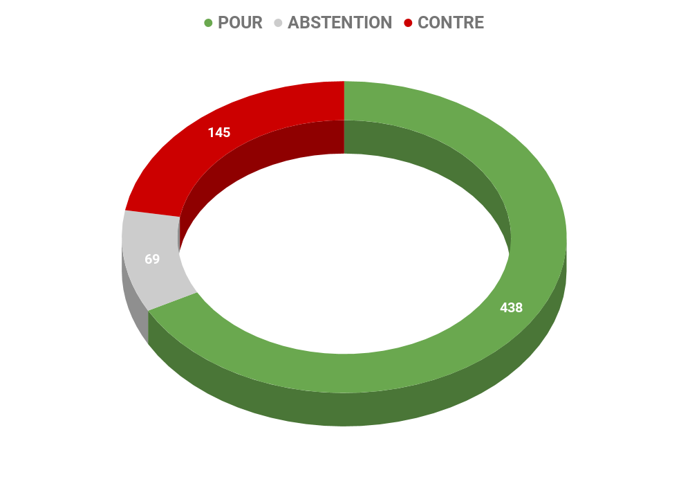
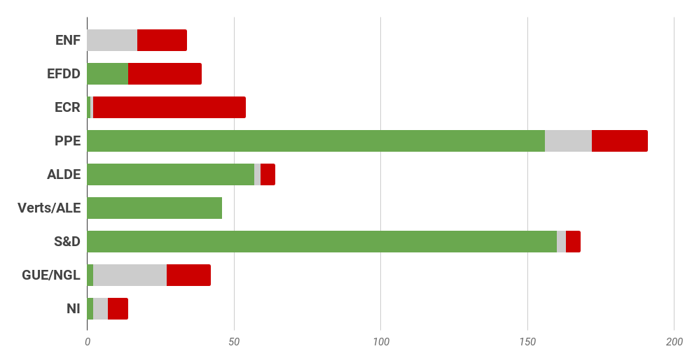
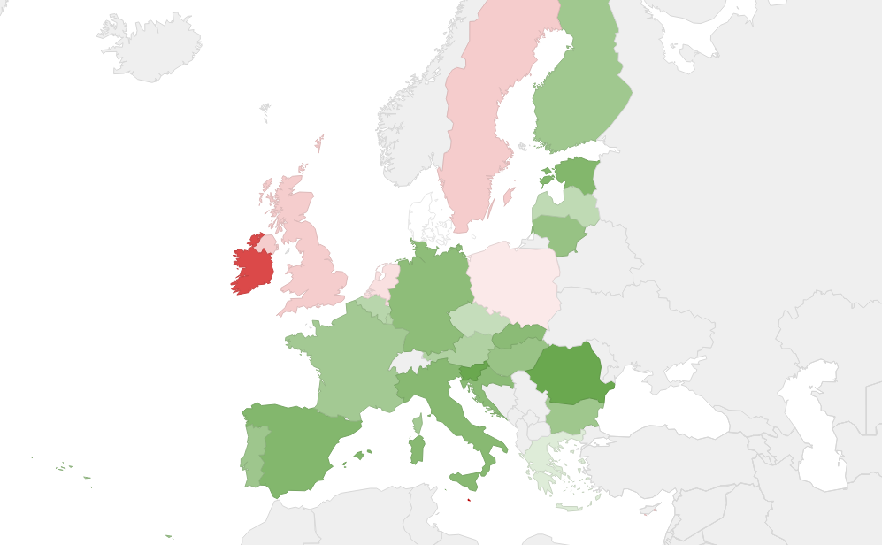

# **Rapport A8-0051/2018** Assiette Commune consolidée pour l'impôt sur les sociétés 

## Des pratiques d'optimisation fiscale agressives nuisant aux pays européens

L'impôt sur les sociétés a toujours été un élément emblématique de la concurrence fiscale en Europe. Les modalités de cette concurrence ont d'ailleurs fortement évolué au fil des ans et ont pris successivement différentes formes, qui se sont parfois enchevêtrées. Si les risques que la concurrence fiscale pouvait faire peser sur le marché commun avaient été implicitement identifiés dès le rapport Neumark de 1962, ce n'est qu'en 1992 avec le rapport Ruding que **la notion de concurrence fiscale dommageable** a été véritablement abordée. À l'heure actuelle, les entreprises de l'UE doivent satisfaire aux prescriptions de **28 systèmes différents d'imposition des sociétés, ce qui peut constituer une charge administrative considérable et faire obstacle aux investissements transfrontières** dans l'UE. De plus, les différences entre les régimes nationaux d'impôt des sociétés dans l'UE créent des conditions propices à ce que les entreprises transnationales mettent en place des systèmes de planification fiscale agressive, qui consistent généralement à transférer leurs bénéfices dans les pays à régime fiscal privilégié (les régimes dits "préférentiels"). Cette pratique, aussi appelée "transfert de bénéfices" porte préjudice au budget d'un pays et contribue à l'érosion de la base d'imposition.

### 7 années de débats entre les Etats membres 

Dès mars 2011 la Commission a proposé un texte relatif à une ACCIS qui vise à offrir un environnement fiscal unifié aux entreprises qui s'appliquerait sur tout le marché intérieur. Compte tenu de la lenteur des débats, il a été proposé en 2015 de procéder en 2 étapes pour parvenir à cette unification : mettre en place dans un premier temps [une assiette commune](http://www.europarl.europa.eu/RegData/docs_autres_institutions/commission_europeenne/com/2016/0685/COM_COM(2016)0685(ANN)_FR.pdf), puis une assiette commune consolidée. 

## Prévenir l'évasion fiscale et prémunir les entreprises contre une double imposition

Le Parlement européen a exprimé son soutien au projet d'ACCIS à de nombreuses reprises. En 2008, il a salué l'intention de la Commission de lancer l'ACCIS et a adopté en 2012 le rapport de Marianne Thyssen, lequel préconisait que l'ACCIS soit appliquée dans les plus brefs délais au plus grand nombre de sociétés possible. En 2015, dans sa résolution sur les rescrits fiscaux et autres mesures similaires par leur nature ou par leur effet (TAXE 1), le Parlement a appelé de ses voeux la création d'une ACCIS obligatoire et a réitéré cet appel dans sa résolution de 2016 (TAXE 2).

## Un dispositif efficace et garantissant une équité fiscale 

Si le rapport voté par les eurodéputés ne lie pas les Etats membres, ni la Commission, ils expriment néanmoins des recommandations utiles. Ils demandent que la directive établisse une assiette commune pour l'imposition de certaines sociétés dans l'Union et définisse les règles de calcul de cette assiette, y compris des dispositions relatives à la lutte contre l'évasion fiscale et des mesures relatives à la dimension internationale du régime fiscal proposé. Par ailleurs, le Parlement européen considère que l'ACCIS garantirait que les impôts seront payés dans le pays où les bénéfices sont générés et où les entreprises ont un établissement stable. Une telle approche servirait au mieux l'objectif d'élimination des distorsions qui perturbent le fonctionnement du marché intérieur et permettrait de lutter contre la planification fiscale agressive.

### Accélérer la mise en oeuvre

Les députés considère que la nécessité d'agir rapidement afin d'assurer le bon fonctionnement du marché intérieur pour qu'il soit plus favorable aux échanges et à l'investissement et plus résistant face aux mécanismes d'évasion fiscale commande que la [directive](http://www.europarl.europa.eu/oeil/popups/ficheprocedure.do?reference=2016/0337(CNS)&l=fr) relative à une assiette commune pour l'impôt sur les sociétés et la directive relative à une assiette commune consolidée pour l'impôt des sociétés entrent en vigueur de façon simultanée.

### Des dispositions applicables à tous les Etats membres… et non membres

*   les règles devraient s'appliquer à **une société constituée conformément à la législation d'un État membre, y compris à ses établissements stables et à ses établissements stables numériques situés dans d'autres États membres**, lorsque la société remplit des conditions spécifiques, en particulier lorsqu'elle appartient à un groupe consolidé dont le chiffre d'affaires consolidé total a dépassé 750 millions d'EUR au cours de l'exercice précédant l'exercice concerné. 
*   Pour lutter contre l'évasion fiscale et l'optimisation, les députés préconisent que l'assujettissement à l'impôts sur les sociétés s'appuierait sur la une notion élargie de l'établissement fiscal et pas uniquement de "résident fiscale". C'est à dire que le contribuable résident serait assujetti à l'impôt sur les sociétés pour **tous les revenus générés par toute activité, à l'intérieur ou en dehors de son État membre de résidence fiscale**. Ou bien, un contribuable non résident devrait être assujetti à l'impôt sur les sociétés pour **tous les revenus issus d'une activité réalisée par l'intermédiaire d'un établissement stable, y compris par l'intermédiaire d'un établissement stable numérique, dans un État membre**. Mettre en place des mesures visant à lutter contre l'évasion fiscale. 
*   A termes, les Etats membres sont appelés à **ajuster leur seuil d'imposition sur les sociétés à une moyenne de 25%** 

### Mettre en place des mécanismes communs et veiller à une progressivité des mesures 

*   Il est suggéré que les bénéfices imposables (dans le cas où une entreprise aurait ses activités dans plusieurs Etats membres) soient partagés entre les Etats où elle exerce ses activités, selon une clé de répartition pondérée qui tiendrait compte : du chiffre d'affaire, des immobilisations, de la main d'oeuvre et la collecte et l'exploitation de données à caractère personnel à des fins commerciale, pour que les activités numériques soient prises en compte. 
*   Il est proposé de mettre en place un mécanisme de compensation pour absorber les chocs soudains qui pourraient être subis par les Etats membres, qu'ils s'agissent de gains ou de pertes fiscaux, qui doit être opérationnel dès l'entrée en vigueur de la directive pour que les effets ne se fassent pas sentir sur les budgets des Etats. Cette compensation serait ajustée chaque année, et la période initiale de fonctionnement serait de 7 ans. 
*   Le Parlement européen propose enfin que soit organisée une conférence interparlementaire [lien vers pédagogie] pour permettre l'évaluation du régime commun, qui serait lié aux discussions existantes dans le cadre de la procédure du [Semestre européen](http://www.consilium.europa.eu/fr/policies/european-semester/).  

## Résultat des votes

## Quelques sources pour approfondir le sujet… 

*   Rapports complets: 
    *   Assiette commune : [☍ suivre le lien](http://www.europarl.europa.eu/RegData/docs_autres_institutions/commission_europeenne/com/2016/0685/COM_COM(2016)0685(ANN)_FR.pdf) 
    *   Assiette commune consolidée : [☍ suivre le lien](http://www.europarl.europa.eu/sides/getDoc.do?type=REPORT&mode=XML&reference=A8-2018-0051&language=FR)
*   [☍ suivre le lien](https://www.touteleurope.eu/actualite/le-projet-d-assiette-commune-consolidee-de-l-impot-sur-les-societes-accis.html) 
*   [☍ suivre le lien](http://www.europarl.europa.eu/sides/getDoc.do?pubRef=-//EP//NONSGML+COMPARL+PE-608.035+01+DOC+PDF+V0//FR&language=FR) 
*   [☍ suivre le lien](http://data.consilium.europa.eu/doc/document/ST-9019-2017-INIT/fr/pdf)
*   [☍ suivre le lien](http://europa.eu/rapid/press-release_IP-16-3471_en.htm?locale=FR)
*   [☍ suivre le lien](http://www.europarl.europa.eu/france/fr/les-dialogues-l%C3%A9gislatifs/table-ronde-sur-le-projet-d-assiette-commune-pour-l-imp%C3%B4t-sur-les-soci%C3%A9t%C3%A9s-acis?webaction=view.acceptCookies)

