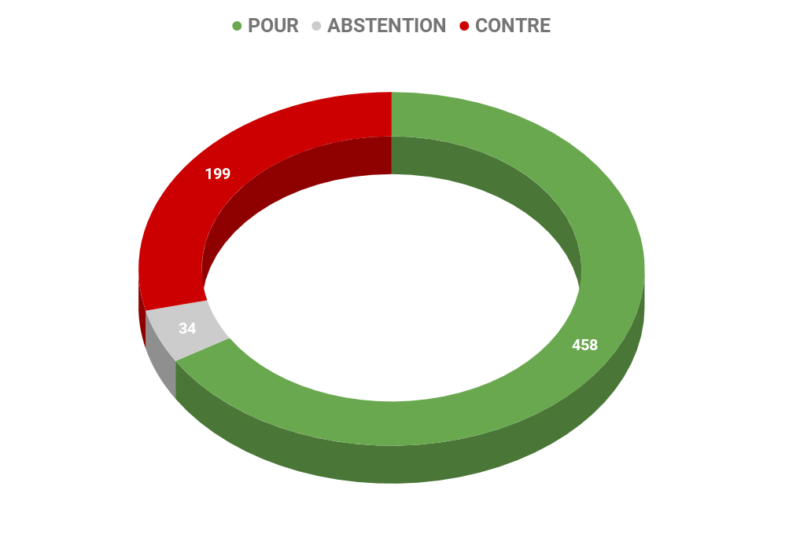
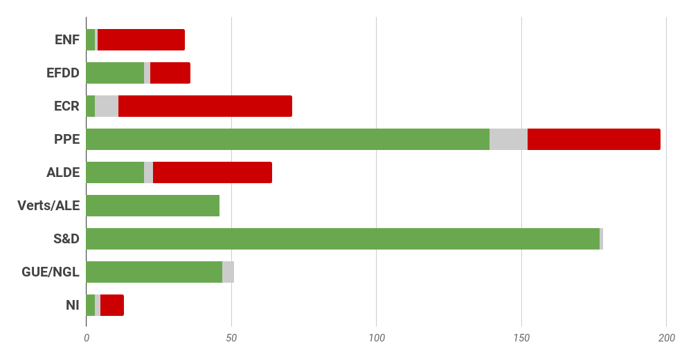
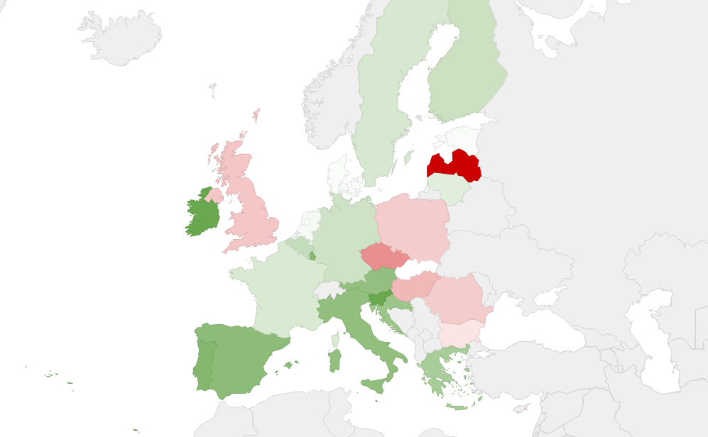

# **Rapport A8-0255/2016** Dumping social dans l'Union européenne

## Des pratiques abusives nocives pour les citoyens européens

La multiplication des pratiques abusives et le recours croissant au dumping social, en tant que pratiques abusives qui encouragent une concurrence déloyale, affaiblissent le soutien en faveur du principe du marché intérieur et à la compétitivité des entreprises, en particulier des PME, portent atteinte aux droits des travailleurs européens et ébranlent la confiance dans l'intégration européenne.

## Renforcer les contrôles et la coordination pour lutter contre le dumping 

Le Parlement a rappelé que malgré l'absence de définition universellement partagée et juridiquement reconnue du dumping social, la notion recouvre un large éventail de pratiques abusives et situations qui peuvent avoir une incidence grave sur le plan économique, social et financier. **Le recours à des pratiques illégales ou abusives est en effet préjudiciable aux entreprises de bonne foi, mais surtout de telles méthodes peuvent mener à une discrimination et de profondes inégalités entre les travailleurs européens. Enfin, le manque à gagner budgétaire du non-paiement de cotisations sociales pèse sur les finances publiques des Etats et handicape l'ensemble des citoyens**. 

## Garantir des conditions de concurrence équitable et loyale dans toute l'Union 

Les eurodéputés ont ainsi proposé plusieurs pistes pour remédier à une situation inique, qui encourage la défiance à l'égard de l'Union européenne, et ne répond pas aux exigences de solidarité entre les Etats. 

### Au niveau des Etats membres :

*   **renforcer l'efficacité et les effectifs des organes de contrôle** (notamment les inspections du travail et des affaires sociales) par le biais de l'échange de bonnes pratiques et de répondre au critère d'une personne chargée de l'inspection pour 10.000 travailleurs ;
*   améliorer la coopération transfrontalière entre les services d'inspection et de généraliser l'échange électronique d'informations et de données entre les États membres;
*   **élaborer des programmes de formation continue à l'échelle de l'Union pour les inspecteurs **pour déterminer les nouvelles techniques de contournement des règles et organiser des contrôles transfrontaliers ;
*   créer, le cas échéant, des task forces ad hoc bilatérales et, si nécessaire, une task force multilatérale intégrant les autorités nationales compétentes et les inspecteurs du travail, pour effectuer, avec l'accord de tous les États membres concernés, des contrôles transfrontaliers sur site, dans le cas d'un dumping social présumé ;
*   **améliorer les échanges d'informations en matière de sécurité sociale concernant les travailleurs**.

### Pour la Commission européenne

*   **lutter contre les sociétés «boîte aux lettres»* *en généralisant le principe selon lequel chaque société doit disposer d'un siège social et de veiller à ce qu'en cas de libre prestation des services utilisant des travailleurs détachés, chaque prestataire de services concerné ait une «véritable activité» dans l'État membre d'établissement, et dès lors, constitue une «véritable entreprise» ;
*   mettre en place des mesures qui garantissent que, dans les chaînes de sous-traitance du secteur de la construction, **les travailleurs détachés puissent tenir le titulaire du marché comme étant responsable du respect des droits des travailleurs**.
*   renforcer les contrôles du respect des temps de travail, de disponibilité, de conduite et de repos dans tous les secteurs pertinents pour les travailleurs mobiles, ainsi que des sanctions en conséquence pour les infractions graves.
*   envisager de créer une agence européenne du transport routier, chargée de faire appliquer correctement la législation de l'Union et de promouvoir la coopération entre tous les États membres sur ces questions. 
*   surveiller et garantir le respect et l'application des législations sociales et des conventions collectives nationales par les compagnies aériennes dont les bases opérationnelles sont situées sur le territoire de l'Union;
*   **associer le développement de l'économie numérique et collaborative à la protection des travailleurs** dans ce nouveau secteur où les formes de travail plus flexible peuvent conduire à des emplois plus précaires et moins réglementés.
*   **proposer l'instauration de planchers salariaux sous la forme d'un salaire minimum national**, dans le but de parvenir progressivement à au moins 60% du salaire moyen au niveau national, de manière à éviter les écarts salariaux excessifs.
*   élaborer une liste des entreprises à l'échelle européenne responsables de graves violations de la législation sociale et du travail européenne, consultable uniquement par les autorités d'inspection pertinentes. **L'accès aux marchés publics, aux subventions publiques et aux fonds de l'Union européenne devrait être refusé à ces entreprises** pendant une période fixée légalement

## Résultat des votes

## Quelques sources pour approfondir le sujet… 

*   Retrouvez le rapport complet : [☍ suivre le lien](http://www.europarl.europa.eu/sides/getDoc.do?pubRef=-//EP//TEXT+REPORT+A8-2016-0255+0+DOC+XML+V0//FR&language=fr) 
*   Mieux comprendre les droits sociaux en Europe : [☍ suivre le lien](https://www.touteleurope.eu/actualite/l-emploi-et-le-social-dans-l-union-europeenne.html) 
*   Et depuis l'adoption du rapport ? 
    *   [☍ suivre le lien](https://en-marche.fr/articles/actualites/travailleurs-detaches) 
    *   [☍ suivre le lien](https://en-marche.fr/articles/opinions/pour-une-europe-sociale-qui-protege) 
    *   [☍ suivre le lien](https://www.touteleurope.eu/actualite/qu-est-ce-que-la-directive-sur-les-travailleurs-detaches.html) 
    *   [☍ suivre le lien](https://medium.com/@EuropeEnMarche/travailleurs-d%C3%A9tach%C3%A9s-de-r%C3%A9elles-avanc%C3%A9es-pour-une-europe-qui-prot%C3%A8ge-f94af36f89e5) 
