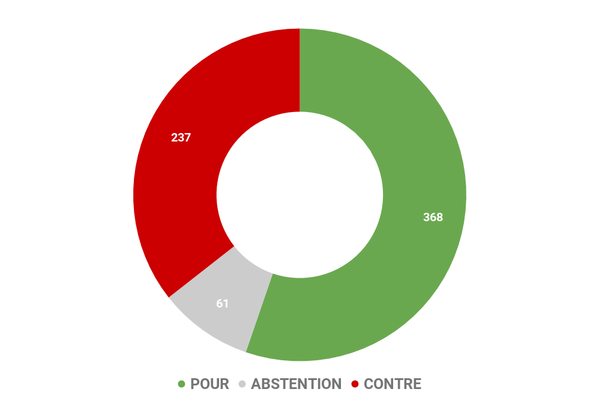
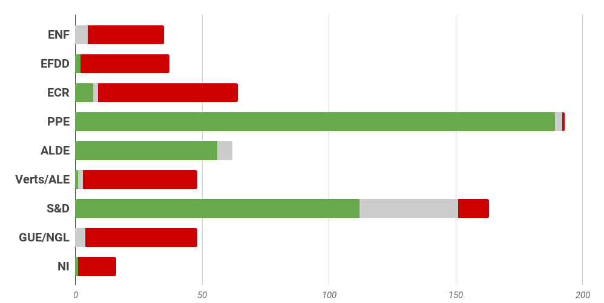
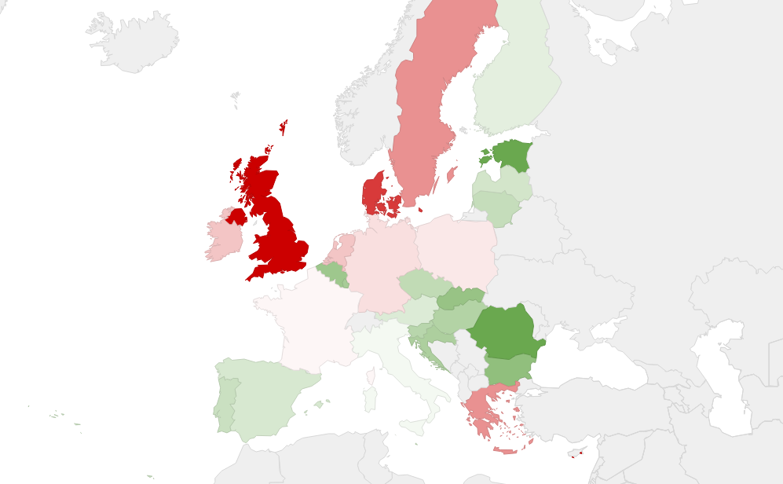

# **Rapport A8-0351/2017** Fond de Défense européen

## Une Europe de la défense en plein dynamisme 

L'Europe de la défense est une réalité concrète depuis le début des années 2000. La mise en oeuvre par l'UE à partir de décembre 2008 de **l'Opération Atalante** constitue par exemple un important succès militaire pour l'UE, le nombre d'attaques étant passé de 168 en 2008 à une seule attaque en 2016. **L'Europe de la défense a trouvé un nouveau souffle en 2016 à la suite du Brexit. En 2017, 25 Etats ont décidé de rejoindre la coopération structurée permanente (CSP). Les Etats partis à la CSP ont déjà acté 17 projets **tels qu'un commandement médical européen ou encore une simplification et standardisation des procédures de transport militaire transfrontalières. 

**La mise en œuvre du fonds européen de défense (FED) a été approuvée en 2017. **Ce fonds comporte un volet recherche et un volet capacité afin de financer des acquisitions en commun moins coûteuses. A partir de 2020, le budget annuel du volet recherche sera de 500 millions d'euros. Celui du volet capacité sera d'un milliard d'euros par an pour l'après 2020.** **Ce programme mobilisera des financements nationaux et aura un effet multiplicateur escompté de cinq. 

## Etablir une coopération concrète dans le cadre de la PESC pour être efficace sur la scène mondiale

Le rapport souligne que l'Union doit redoubler d'efforts pour établir une coopération concrète dans le cadre de la politique de sécurité et de défense commune et agir efficacement sur la scène mondiale, ce qui implique de parler d'une seule voix et d'agir de concert. **Les eurodéputés se félicitent en particulier qu'ait été lancée la création d'un fonds européen de la défense. Ils saluent également l'activation de la CSP.** 

## Les Recommandations portées par le rapport

### Pour les États membres

*   Le rapport demande l'établissement d'un véritable **quartier général stratégique militaire et civil européen** dans le cadre de la CSP. Il encourage les États membres à participer à la CSP pour mettre en place une « **_Force européenne intégrée_ **» **composée de divisions venant des armées nationales et la mettre à la disposition de l'Union;**
*   **Les députés estiment que la CSP devrait s'étendre dans le cadre de l'Union** et qu'elle devrait bénéficier du soutien effectif de l'Union tout en respectant pleinement les compétences des États membres en matière de défense. Ils réitèrent leur demande d'un **financement approprié** **de la CSP par le budget de l'Union;**
*   Ils demandent d'accroître leurs efforts pour améliorer la cybersécurité et encouragent les États membres à se porter mutuellement assistance en cas de cyberattaque menée contre l'un d'entre eux;
*   Les députés estiment que les États membres devraient redoubler d'efforts pour agir à la fois dans le cadre d'une union européenne de la défense et en tant que pourvoyeurs autonomes de sécurité régionale, sans oublier, le cas échéant, de jouer un rôle complémentaire au sein de l'OTAN;
*   **Le rapport considère que le Royaume-Uni devrait, s'il le demande, pouvoir également prendre part aux missions de la PSDC dans le cadre d'une nouvelle relation de coopération entre l'UE et le Royaume-Uni dans le domaine de la défense.**

### Pour la Commission européenne

*   **Les eurodéputés exhortent la haute représentante de l'Union pour les affaires étrangères et la politique de sécurité et la Commission à agir en vue de la publication d'un livre blanc sur la sécurité et la défense de l'Union dans le cadre de la préparation du prochain cadre financier pluriannuel (CFP);**
*   Le rapport suggère également d'évaluer la possibilité de mettre en place une **direction générale de la défense** **au sein de la Commission.**

### Pour le Parlement européen

*   Le Parlement devrait transformer sa sous-commission sur la sécurité et la défense (SEDE) en une **commission parlementaire à part entière**.

## Résultat des votes

## Quelques sources pour approfondir le sujet… 

* Lien du rapport : [☍ suivre le lien](http://bit.ly/2FRqPRn)
* Lien vers le dossier correspondant sur Touteleurope.eu : [☍ suivre le lien](http://bit.ly/2FjukSW)
* Lien vers l'actualité pertinente du gouvernement : [☍ suivre le lien](http://bit.ly/2CXBB5O)
* Stratégie Globale de l'UE : vers une autonomie stratégique européenne ? : [☍ suivre le lien](http://bit.ly/2oPXr6h)
