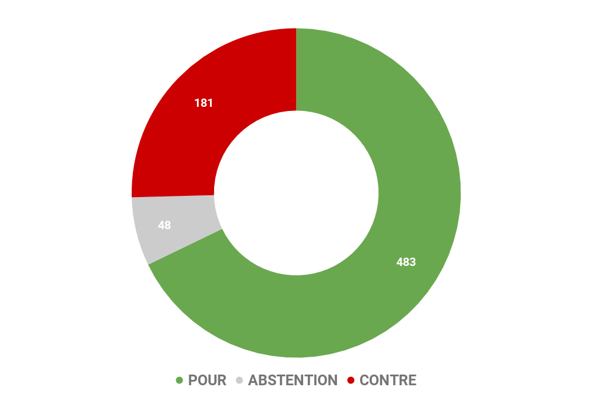
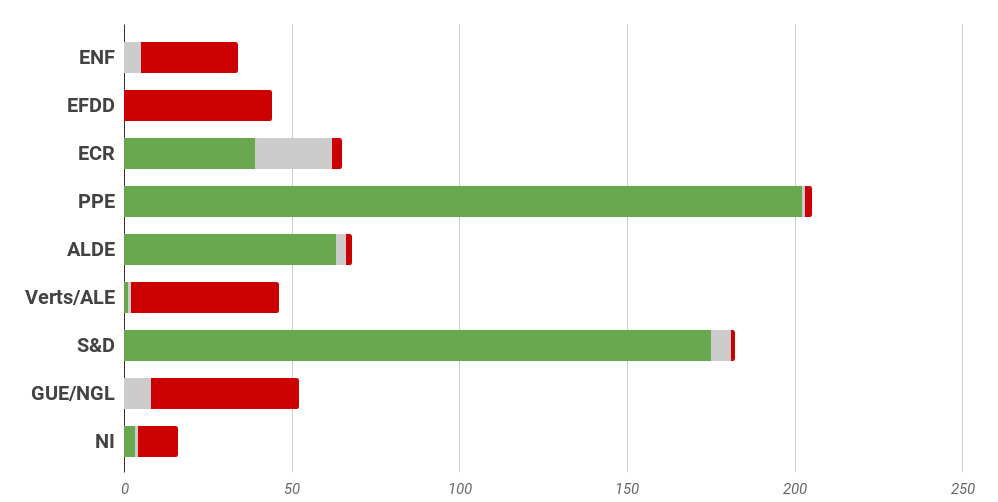
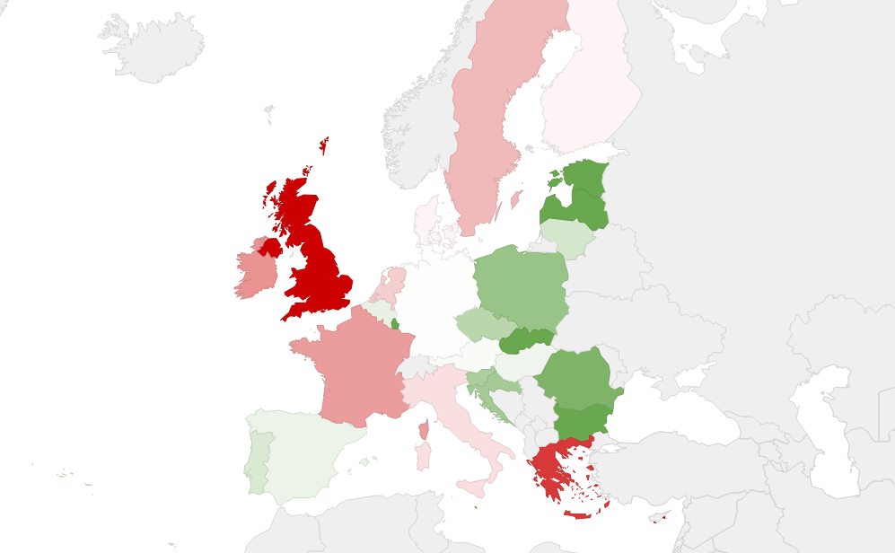

# **Rapport A8-0200/2016** Corps européen de gardes frontières et de gardes côtes

## Assurer une gestion intégrée des frontières de l’Union européenne

La crise des réfugiés a mis à mal les frontières de l’Union européenne depuis 2015, et a démontré l’inadéquation des moyens existants pour répondre aux attentes des citoyens et des Etats. L’espace Schengen qui assure une libre-circulation des personnes à l’intérieur de ses frontières ne peut être durablement viable qu’à la condition que les frontières extérieures soient protégées et contrôlées. 

Face à ce constat, la Commission européenne a proposé dès le mois de décembre 2015 un projet de règlement visant à instaurer un corps européen de gardes frontières et de gardes côtes piloté par une Agence européenne indépendante dédiée. 

Le texte initial soumis au vote des Etats et du Parlement européen a proposé un périmètre pour les actions de cette nouvelle Agence qui inclurait :

* Une **surveillance des flux migratoires** permettant d’analyser les risques, en coopérant avec les Etats membres. Cette surveillance doit être l’occasion d’**évaluer la vulnérabilité des frontières extérieures** et d’**imposer aux Etats concernés**, le cas échéant, **des réformes** pour remédier aux manquements observés. 

* En cas de manquements répétés des Etats, et de refus de mettre en oeuvre les actions proposées pour assurer une meilleure sécurité aux frontières, la Commission pourrait permettre **une intervention directe de l’Agence sur le terrain**. 

* La création d’**un corps d’intervention composé de 1 500 gardes frontières** et l’acquisition de moyens techniques qui soutiendraient les actions spécifiques de l’Agence dans le cadre de ses missions de contrôle, d’évaluation, et d’aide au retour. 

* Un **appui pour l’aide au retour afin de veiller au retour effectif des personnes en séjour irréguliers**, en coordonnant et organisant les opérations de retour pour renforcer les systèmes existants dans les Etats membres. L’Agence mettrait notamment à disposition des Etats membres des équipes de contrôleurs, d’escortes et de spécialistes. Elle s’appuierait également sur **une coopération accrue avec les pays tiers** que ce soit en matière d’échange d’informations ou de présence sur le terrain. 

* Un mécanisme de **plaintes pour lutter contre les éventuelles violations des droits fondamentaux** lors des activités serait mis en place, pour garantir la protection des droits fondamentaux des migrants sous sa responsabilité. 

Le budget total proposé pour cette nouvelle Agence sur la base de ce périmètre d’intervention s’élèverait à 270 millions d’euro (pour 2017), grâce au redéploiement des fonds existants pour d’autres Agences, soit une augmentation de 31,5 millions d’euro par rapport à 2016. 

## Une responsabilité partagée avec les Etats membres et davantage de contrôle des actions de l’Agence

Après examen en Commission, le Parlement européen a souhaité apporter des modifications en première lecture. Il a notamment mis l’accent sur : 

* Une pérennisation du cadre existant de FRONTEX dont la mission pourrait être élargie en coopération avec les Etats membres, et la dénomination modifiée pour devenir "l’Agence européenne de gardes-frontières et de gardes-côtes" : **la nouvelle Agence devrait se coordonner avec les autres agences compétentes**. 

* Le rôle de cette agence devrait être **limité à la définition d’une stratégie conduisant à une gestion intégrée des frontières**, la supervision du fonctionnement du contrôle, une **assistance aux Etats** membres dans le cadre d’intervention conjointe, et l’organisation et la coordination des opérations de retours ; sans apprécier la pertinence de la décision conduisant à prononcer le retour, **les Etats membres sont seuls souverains pour décider du retour ou non des migrants**. L’Agence serait responsable devant le Conseil européen et le Parlement européen qui valideraient également les nomination aux postes exécutifs de l’Agence. **Seul le Conseil, sur proposition de la Commission, peut déterminer l’opportunité d’une intervention** à la frontière d’un Etat membre, en cas de refus d’intervention les autres Etats pourraient réintroduire temporairement des contrôles aux frontières intérieures. **Seul le Conseil aurait une compétence d’exécution**, parce qu’il est seul à être en mesure d’apprécier la sensibilité politique d’une mesure. Ainsi, l’**Agence a un rôle consultatif dans la définition des stratégies de contrôles au frontière et de retours**.

* Enfin, l’Agence aurait à contribuer à la **lutte contre les trafics et la traite** d’êtres humains ainsi qu’à la lutte **contre le terrorisme**. Elle devrait également comprendre des experts spécialisés dans la **protection des enfants**.

## Résultat des votes

## Quelques sources pour approfondir le sujet… 

### Proposition initiale de la Commission européenne

* Texte complet : [http://eur-lex.europa.eu/legal-content/EN/TXT/?qid=1520260369916&uri=CELEX:52015PC0671](http://eur-lex.europa.eu/legal-content/EN/TXT/?qid=1520260369916&uri=CELEX:52015PC0671) 

* Résumé : [http://www.europarl.europa.eu/oeil/popups/summary.do?id=1416708&t=e&l=fr](http://www.europarl.europa.eu/oeil/popups/summary.do?id=1416708&t=e&l=fr) 

### Texte final

* Version complète : [☍ suivre le lien](http://eur-lex.europa.eu/legal-content/FR/TXT/HTML/?uri=CELEX:32016R1624&from=EN) 

* Résumé : [☍ suivre le lien](http://www.europarl.europa.eu/oeil/popups/summary.do?id=1452625&t=f&l=fr) 

### Rapport sur le texte

* Lien du rapport : [☍ suivre le lien](http://www.europarl.europa.eu/sides/getDoc.do?pubRef=-//EP//TEXT+REPORT+A8-2016-0200+0+DOC+XML+V0//FR) 

### En savoir plus

* Histoire européenne de la politique d’asile et d’immigration : [☍ suivre le lien](https://www.touteleurope.eu/actualite/histoire-de-la-politique-europeenne-d-immigration-et-d-asile.html) 

* Plan d’action du gouvernement pour garantir le droit d’asile et mieux maîtriser les flux migratoires : [☍ suivre le lien](http://www.gouvernement.fr/conseil-des-ministres/2017-07-12/plan-d-action-pour-garantir-le-droit-d-asile-et-mieux-maitri) 
