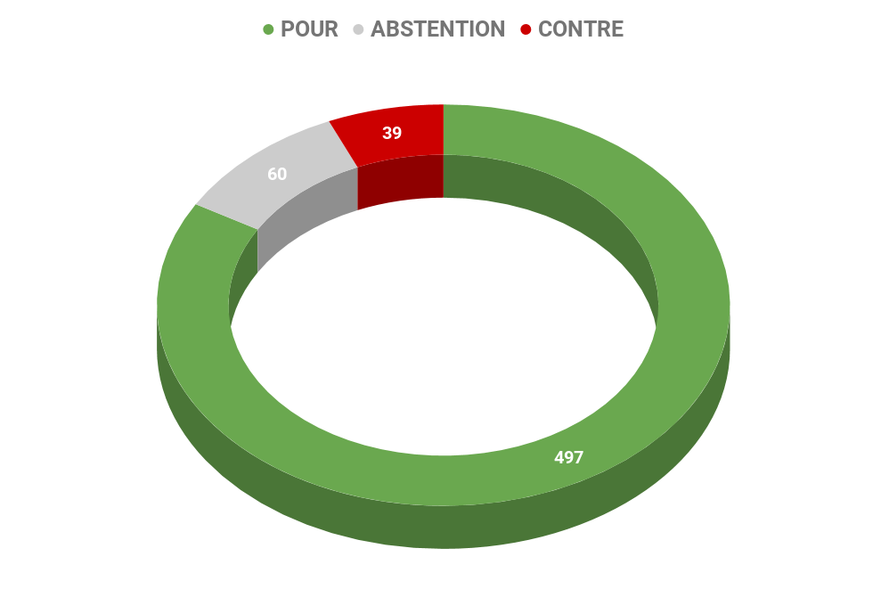
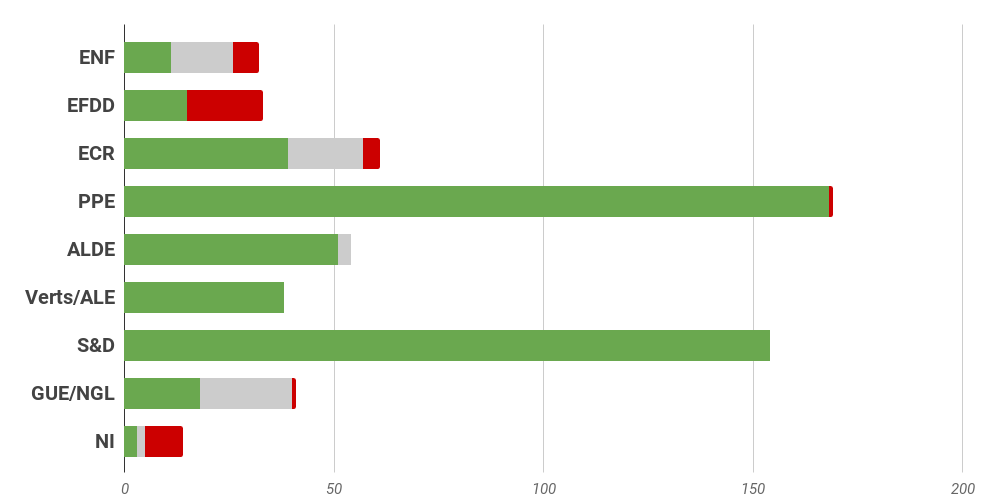
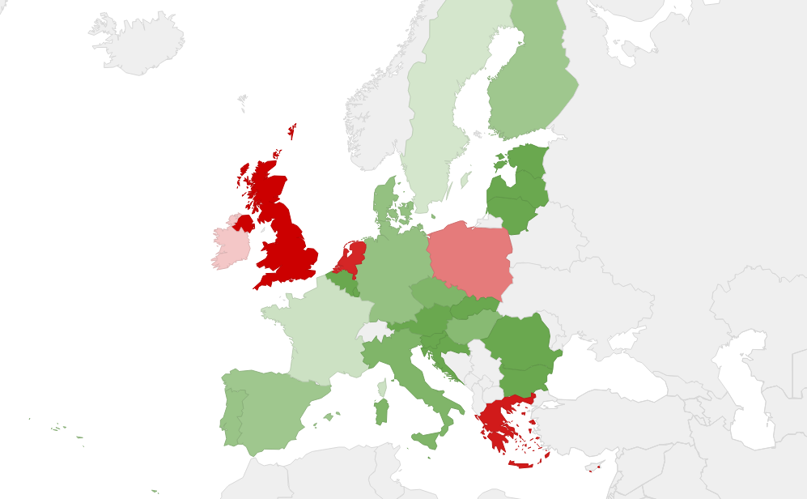

# **Rapport A8-0389/2016** Mise en oeuvre du Programme Erasmus+

## Erasmus ou l'histoire d'un succès européen

### Le programme Erasmus a fêté ses **30 ans en 2017**

Ce sont des **agences nationales** qui gèrent le programme dans chacun des **33 pays participants**.  Depuis 2014, la Commission européenne a mis en place **le programme ERASMUS + qui regroupe tous les autres programmes de mobilité européens** dédiés à l'éducation, la formation, le sport et la jeunesse (Erasmus, Leonardo, SVE, Grundtvig, Comenius, ..) et s'adresse donc à des **publics variés** : étudiants, apprentis, formateurs, collégiens, lycéens, jeunes diplômés, demandeurs d'emploi. 

Le programme mis en place par la Commission s'articule autour de **3 actions clés** :
* Action clé 1 - La mobilité à des fins d'apprentissage ;
* Action clé 2 - Coopération pour l'innovation et l'échange de bonnes pratiques ;
* Action clé 3 - Soutien à la réforme politique)

Il couvre **cinq champs éducatifs** (jeunesse, éducation des adultes, enseignement scolaire, formation professionnelle et enseignement supérieure) et **deux volets complémentaires** (sport et Jean Monnet qui soutient l'innovation, le partage des connaissances et la communication dans le domaine des affaires européennes).

Doté d'un budget de **16.5 milliards d'euros pour la période 2014-2020** (1.26 milliards d'euros pour la France), il vise à offrir à plus de quatre millions de personnes la possibilité d'acquérir des compétences et de se développer sur les plans personnel, socio-éducatif et professionnel dans le cadre d'études, de formations, d'expériences professionnelles ou d'activités de volontariat à l'étranger, proposées dans le monde entier. Il vise à encourager l'amélioration de la qualité, l'innovation, l'excellence et l'internationalisation des organisations actives dans les domaines de l'éducation et de la formation, de la jeunesse et du sport. 

### Surmonter les obstacles bureaucratiques pour améliorer le programme

Le Parlement européen considère que, globalement, **Erasmus + est un programme qui fonctionne** et que ses **objectifs dans les domaines de l'éducation, la formation et la jeunesse semblent atteints**, le programme jeunesse étant le plus prisé. Il considère qu'il joue notamment un **rôle fondamental pour favoriser l'identité et l'intégration européenne**, la citoyenneté européenne, la solidarité, une croissance durable et inclusive, des emplois de qualité, la compétitivité, la cohésion sociale, la mobilité professionnelle. Selon le Parlement européen, le programme permet d'améliorer les systèmes d'enseignement et de formation, la formation continue, l'acquisition d'aptitudes et de compétences personnelles et professionnelles transversales et transférables, des compétences linguistiques, et donc **l'employabilité des jeunes Européens**.

Toutefois, le Parlement constate que les deux premières années de mise en œuvre du programme ont été difficiles pour toutes les parties prenantes notamment du fait d'**obstacles bureaucratiques nombreux**. Il constate également un **manque de visibilité des programmes sectoriels** et une **dimension scolaire du programme encore insuffisante**.

Les députés européens  se félicitent de l'**augmentation budgétaire du programme** par rapport à la période 2007/2013 et demandent que le **niveau actuel du budget soit garanti** pour la prochaine génération de programmes après 2020. Ils estiment qu'une nouvelle augmentation serait même souhaitable pour avoir moins de projets rejetés.

Ils constatent que **seulement 1% des jeunes en formation professionnelle** partent en mobilité au cours de leur formation, ils souhaitent donc que les conditions soient créées pour développer leur mobilité au même niveau que les étudiants de l'enseignement supérieure. Ils voudraient aussi que l'innovation et l'inclusion sociale soient deux dimensions renforcées à l'avenir dans le programme. 

## Améliorer le fonctionnement du programme

### Grâce aux Etats et aux Agences nationales

*   **Simplifier les procédures et alléger la charge administrative** pour les étudiants mais aussi pour les structures d'accueil, 
*   **Soutenir davantage les PME** qui proposent des formations professionnelles
*   Harmoniser les critères d'accès et réduire les disparités socio-économiques entre Etats et agences nationales 
*   **Réduire la durée de prise de décision** des candidatures et **avoir plus de transparence **dans leur évaluation 
*   **Cibler de façon prioritaire les jeunes en décrochage scolaire et les jeunes de milieux défavorisés** lors de la mise en œuvre des programmes, en prenant en compte leurs contraintes personnelles (financières, éloignement) ainsi que les petits projets
*   **Mieux communiquer sur tous les programmes sectoriels** existants pour les différents publics : étudiants, enseignants, professionnels, apprentis, etc.
*   F**avoriser davantage la mobilité des enseignants, des professeurs et du personnel non universitaire**
*   **Augmenter le budget octroyé à Erasmus+** pour réduire le nombre de projets refusés
*   Continuer à prendre part au programme pour les jeunes entrepreneurs

### Avec la Commission européenne

*   **Simplifier les procédures** et **alléger la charge administrative** pour les étudiants mais aussi pour les structures d'accueil, rendre le guide du programme plus adapté à l'utilisateur 
*   **Associer le nom Erasmus+ aux différents programmes** (Erasmus+ Mundus, Erasmus+ Leonardo Da Vinci, etc)
*   **Exploiter pleinement la dimension apprentissage** tout au long de la vie du programme en encourageant la coopération intersectorielle
*   **Renforcer le dialogue avec les partenaires sociaux, les autorités locales et la société civile** pour garantir un accès au programme le plus large possible
*   Faire une évaluation du mécanisme de garantie de prêts aux étudiants
*   Présenter un **cadre de qualité pour les apprentissages** et une **proposition visant à accroître la mobilité des apprentis**
*   Améliorer l'accès et la participation au programme d'acteurs de terrain comme les clubs sportifs et de **rendre le sport plus accessible à tous les citoyens**, en lien avec les aspects liés à l'inclusion sociale
*   **Rendre Erasmus + plus accessible** aux personnes ayant des besoins spécifiques (handicap) et issues ou issues de milieux défavorisés, faciliter la participation des écoles et autres petits acteurs
*   **Evaluer les performances des agences nationales**, assurer l'application harmonieuse des règles du programme en respectant les normes de qualité et améliorer les outils informatiques
*   **Mettre à disposition des statistiques récentes** et réaliser des études de suivi sur la mise en œuvre du programme Erasmus+
*   Conserver **l'éducation et la formation à l'entrepreneuriat** comme l'un des objectifs du futur programme post 2020

## Résultat des votes

## Quelques sources pour approfondir le sujet… 

*   Résolution du Parlement européen : [☍ suivre le lien](http://www.europarl.europa.eu/sides/getDoc.do?type=TA&language=FR&reference=P8-TA-2017-0018 )

*   Dossier de Toute l'Europe:
  * Le programme Erasmus+ : [☍ suivre le lien](https://www.touteleurope.eu/actualite/le-programme-erasmus-et-la-mobilite-en-europe.html)
  * 10 chiffres sur le programme Erasmus+ : [☍ suivre le lien](https://www.touteleurope.eu/actualite/10-chiffres-sur-le-programme-erasmus.html )

*   Site européen officiel : [☍ suivre le lien](https://info.erasmusplus.fr/)
*   Site de l'agence française : [☍ suivre le lien](http://www.agence-erasmus.fr/page/erasmus-plus-enseignement-superieur)Erasmus + France
*   Le rapport d'évaluation de la Commission européenne du 31 janvier 2018 : 
