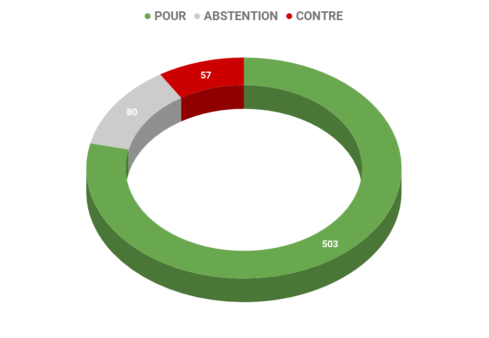
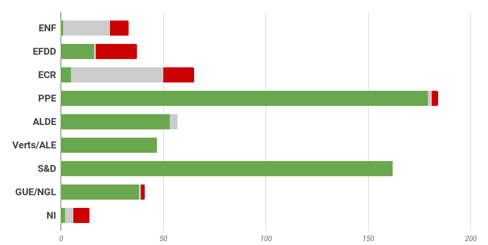
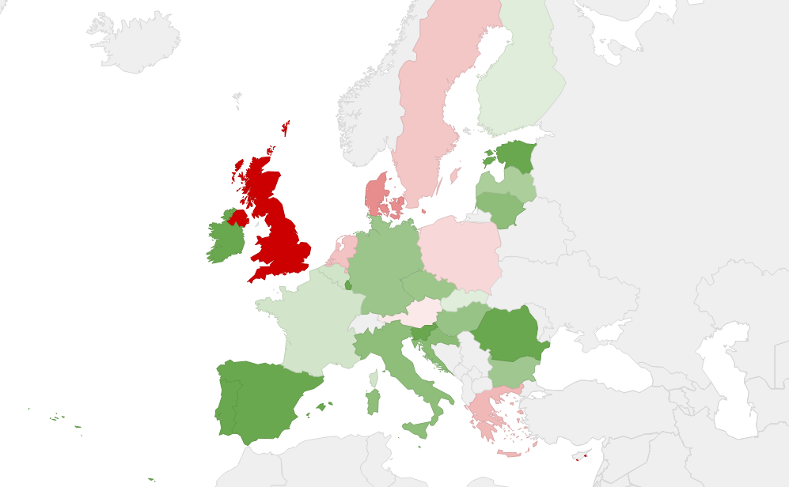

## **Rapport A8-0030/2017** Programme *Europe créative*

## Un financement jugé insuffisant pour le programme Europe créative

Approchant la mi-parcours du programme Europe créative dédié au renforcement de la diversité culturelle et artistique européenne et de la compétitivité des secteurs concernés, ce rapport avait pour but d'évaluer la réalisation des objectifs généraux et spécifiques ainsi que la mise en place dudit programme, effectif du 1er janvier 2014 au 31 décembre 2020.

## La culture comme facteur clé de la promotion de l'intégration européenne

Les eurodéputés sont partis du constat que **le financement du programme « Europe créative », et en particulier de son sous-programme « Culture », est très insuffisant**. Ils ont également constaté que le système d'indicateurs de performance prévus au règlement n'avait pas encore été mis en place et que le système d'évaluation actuel s'était avéré inadapté.

Ils se sont ensuite concentrés sur l'analyse des retours des bénéficiaires qui, entre autres, avaient signalé **une mauvaise gestion administrative, la nécessité de simplifier la procédure de candidature et de diminuer la lourdeur des démarches administratives**.

## Pour une augmentation du budget et une amélioration de la mise en oeuvre du programme

### Pour les États membres

*   **Augmenter le budget du programme «Europe créative»** pour qu'il soit à la hauteur des attentes des citoyens européens comme des ambitions de chaque sous-programme.

### Pour la Commission européenne

*   Tenter de remédier à la sous-représentation des opérateurs microculturels dans les organisations financées et certains secteurs du sous-programme «Culture» ;
*   Renforcer la cohérence du programme avec toutes les politiques pertinentes de l'Union et d'autres sources de financement ;
*   **Travailler aussi étroitement que possible avec l'Unesco, le Conseil de l'Europe et l'OCDE au développement d'un socle plus solide de contributions conjointes** en vue de la réalisation des objectifs du programme et d'une évaluation de ses effets, en particulier du point de vue international et du respect des valeurs spécifiques humaines et économiques de la culture et de la création ;
*   Conserver la structure actuelle du programme «Europe créative» ;
*   Assurer un meilleur **équilibre entre la composante artistique et créative et les aspects liés à la gestion et à l'innovation**, notamment dans le cas des secteurs de la culture et de la création ;
*   Mettre à profit le système d'indicateurs de performance prévu dans le Règlement ;
*   Offrir des possibilités de** formation et de renforcement des capacités aux acteurs du secteur culturel qui désirent améliorer leurs compétences en matière de procédures de candidature**, de gestion générale des projets et de mise en œuvre des projets, et plus généralement **simplifier davantage les procédures de candidature** et de présentation de rapports ;
*   Prendre des mesures afin d'accroître la transparence de la procédure de contestation pour les candidatures rejetées, ce qui **réduirait la frustration générale des candidats** et améliorerait la crédibilité du programme à long terme ;
*   Équilibrer le poids de la dimension économique avec la valeur intrinsèque des arts et de la culture proprement dits, et de se concentrer davantage sur les artistes et les créateurs ;
*   Rechercher les moyens de **faciliter l'accès des réfugiés versés dans les arts au programme** «Europe créative» ;
*   Déterminer si l'attribution de projets de plus petite ampleur aux catégories du programme liées à la production, aux festivals, aux cinémas et à la distribution pourrait augmenter l'efficacité du financement ;
*   Adopter** une démarche proactive pour préparer l'admission de nouveaux pays dans le programme, en accordant un statut spécial aux pays du voisinage** méridional et oriental de l'Europe;
*   Déterminer si la **création d'un observatoire européen de la culture et de la créativité** comparable à l'Observatoire européen de l'audiovisuel serait judicieuse, au vu du grand nombre de disciplines culturelles, cet observatoire devant répondre à des normes comparables à celles de l'Observatoire européen de l'audiovisuel.

## Résultat des votes

## Quelques sources pour approfondir le sujet… 

*   [☍ suivre le lien](http://www.europarl.europa.eu/sides/getDoc.do?type=REPORT&reference=A8-2017-0030&language=FR)
*   [☍ suivre le lien](http://eur-lex.europa.eu/legal-content/FR/TXT/PDF/?uri=OJ:JOC_2017_419_R_0002&rid=1) 
*   [☍ suivre le lien](http://www.europarl.europa.eu/oeil/popups/ficheprocedure.do?lang=fr&reference=2015/2328(INI))
*   [☍ suivre le lien](https://www.touteleurope.eu/actualite/europe-creative-le-programme-pour-les-secteurs-audiovisuel-culturel-et-creatif.html)
