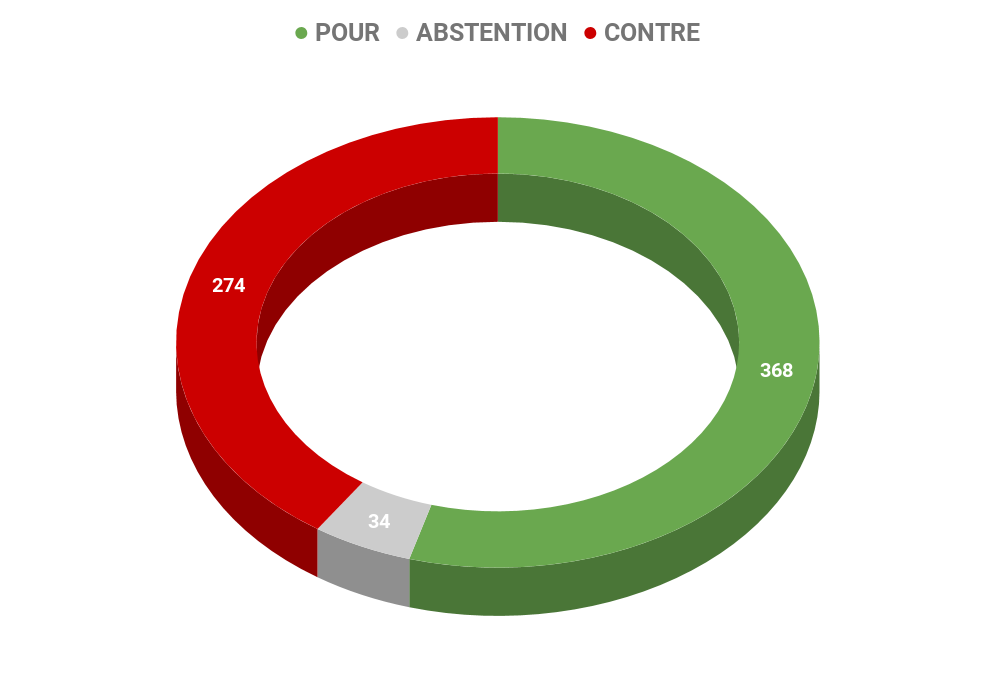
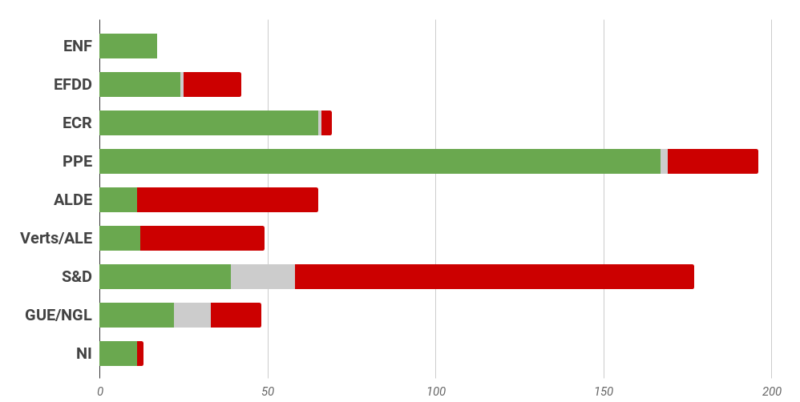
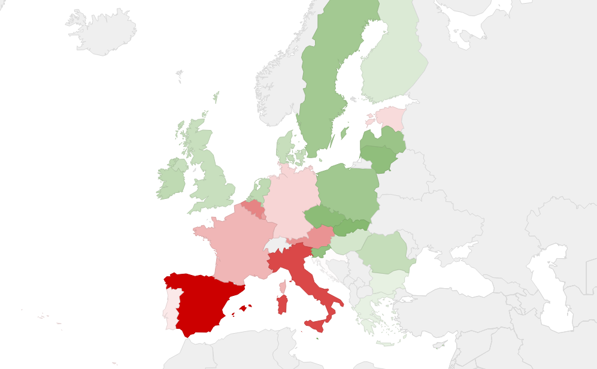

# **Rapport A8-0007/2018** Amendement pour la création d'une circonscription unique à l'échelle de l'Union

## Créer une agora politique européenne

Le principal objectif du projet de création de listes transnationales est la constitution d'un espace politique européen transcendant les frontières. La liste transnationale doit permettre aux débats d'ordre européen de s'affranchir des limites nationales pour permettre aux européens de définir ensemble un horizon commun sans le biais de l'Etat.

Les listes transnationales auraient aussi pour objectif de permettre de** renforcer les partis politiques européens.** Futurs bâtisseurs de listes européennes et coordonnateurs de campagnes à l'échelle continentale, leur poid politiques serait plus important. 

## Les obstacles 

Un changement de traité pourrait être nécessaire pour établir une circonscription unique - entraînant une procédure longue et complexe avec ratification nationale pays par pays. Par ailleurs, les pays d'Europe de l'Est et en particulier le groupe de Visegrad (Pologne, République Tchèque, Slovaquie, Hongrie) sont opposés à cette mesure qui serait susceptible selon eux de **déstabiliser l'équilibre entre institutions européennes et Etat membre**.

La mise en oeuvre pratique des listes transnationales demeure complexe. Il faudrait **créer un droit électoral strictement européen** - harmonisant règles électoral sur le financement et le calendrier partout en Europe. Ce droit s'additionnerait au droit électoral national avec des risques de confusion entre les deux. 

Plusieurs eurodéputés, considèrent que lien entre l'eurodéputé ne pourrait que se distendre par rapport à ce qui existe actuellement, ou craignent un Parlement européen de classe - les petits parlementaires issus de circonscriptions nationales contre les grands issus de la circonscription continentale. 

## Résultat des votes

## Quelques sources pour approfondir le sujet… 

*   Lien du rapport: [☍ suivre le lien](http://www.europarl.europa.eu/sides/getDoc.do?type=REPORT&reference=A8-2018-0007&language=EN#)
*   Lien vers le dossier correspondant sur Touteleurope.eu: [☍ suivre le lien](https://www.touteleurope.eu/actualite/elections-europeennes-la-constitution-de-listes-transnationales-est-elle-possible.html)
*   Communiqué de presse du Parlement suite à l'adoption du rapport en commission: [☍ suivre le lien](http://www.europarl.europa.eu/news/en/press-room/20180123IPR92301/eu-elections-2019-meps-pave-way-for-pan-european-constituency-post-brexit)
*   Tribune en faveur des listes transnationales: [☍ suivre le lien](https://www.telos-eu.com/fr/politique-francaise-et-internationale/pour-lintroduction-de-listes-transnationales-aux-e.html)
*   Rapport Andrew DUFF (2011): [☍ suivre le lien](http://www.europarl.europa.eu/sides/getDoc.do?pubRef=-//EP//TEXT+REPORT+A7-2011-0176+0+DOC+XML+V0//FR#title1)
*   Tribunes des ministres des Affaires européennes français, italien et espagnol en faveur des listes transnationales: [☍ suivre le lien](https://secure.lemonde.fr/sfuser/connexion?url_zop=http%3a%2f%2fabonnes.lemonde.fr%2fidees%2farticle%2f2017%2f11%2f17%2fpour-la-creation-de-listes-transnationales-aux-elections-europeennes_5216536_3232.html)
